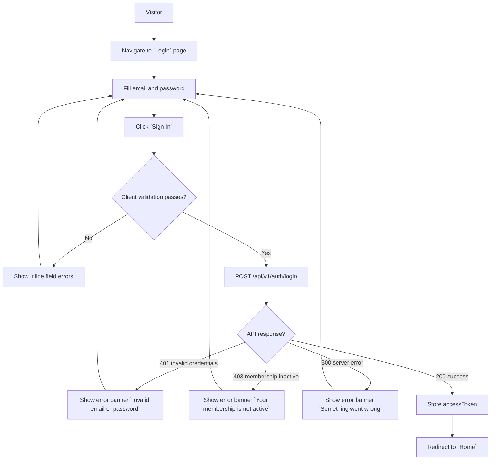
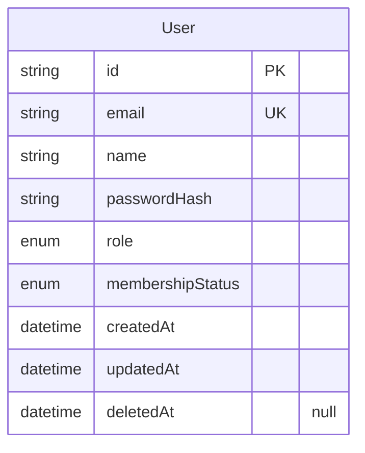
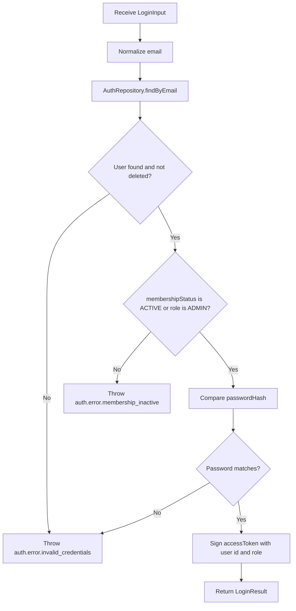

# Login v0

## Changelog Summary

- v0 · 2026-09-04 · Initial feature specification generated from `documentation/00.brief-early.md`.

## Objectives

### Overview

Login is the entry point of the platform for both **Community Members** and **Admin/Influencer** users (see `documentation/00.brief-early.md` §2, §14). A user authenticates with email and password and receives an access token used for all subsequent member-facing requests.

On success the user is redirected to the Home dashboard. On failure an error banner is shown.

Related features (specified separately): Home Dashboard (login redirect target), Profile (contains Logout), Search/Video Library/Updates (protected consumers of the access token).

Out of scope for v0: password recovery, registration/self-signup (members are provisioned by the Admin), social login, remember-me.

### User Flow



### Functional Requirements

| ID | Requirement |
|----|-------------|
| FR-001 | Email field is required and must be a valid email format. |
| FR-002 | Password field is required. |
| FR-003 | Credentials are validated against the `User` record (case-insensitive email match, non-deleted). |
| FR-004 | On success the API returns an `accessToken` and the user is redirected to Home. |
| FR-005 | Wrong email or password shows error banner with message key `auth.error.invalid_credentials` (HTTP 401). |
| FR-006 | A user whose `membershipStatus` is not `ACTIVE` (and is not `ADMIN`) is rejected with `auth.error.membership_inactive` (HTTP 403). |
| FR-007 | Field-level validation errors are shown inline under each field. |
| FR-008 | While submitting, the button is disabled and a loading state is shown. |

## Visual Specification

### Layout

```
+--------------------------------+
|                                |
|            Piranha            |
|                                |
|          Welcome Back          |
|     Sign in to continue        |
|                                |
|  Email Address                 |
|  [____________________]        |
|                                |
|  Password                      |
|  [____________________]        |
|                                |
|  [        Sign In         ]    |
|                                |
+--------------------------------+
```

### UI Components

| Component | Source |
|-----------|--------|
| Card | `src/components/ui/card.tsx` (custom, Tailwind) |
| Input | `src/components/ui/input.tsx` (custom, Tailwind) |
| Button | `src/components/ui/button.tsx` (custom, Tailwind) |
| Alert Banner | `src/components/ui/alert.tsx` (custom, Tailwind) |
| Field Error | `src/components/ui/form-message.tsx` (custom, Tailwind) |

### Responsive Behavior

| Platform | Description |
|----------|-------------|
| Desktop  | Centered card, max-width 420px, vertically centered |
| Tablet   | Same layout, card at 90% width |
| Mobile   | Full-width card with 16px padding |

### States

| State                | Description |
| -------------------- | ----------- |
| Default              | Empty form, `Sign In` enabled |
| Loading              | Button disabled, spinner shown |
| Validation Error     | Invalid field highlighted, inline message under field |
| Authentication Error | Alert banner displayed (`auth.error.invalid_credentials`) |
| Membership Error     | Alert banner displayed (`auth.error.membership_inactive`) |
| Success              | Token stored, redirect to Home |

## Acceptance Criteria

- [ ] User can log in with a valid email and password
- [ ] Invalid credentials show an `Invalid email or password` banner
- [ ] Non-active members are rejected with a membership error banner
- [ ] Empty or malformed email shows an inline validation error
- [ ] Empty password shows an inline validation error
- [ ] Successful login stores the access token and redirects to Home
- [ ] Button is disabled with spinner while submitting

## Technical Specification

### Database Model

#### Entity Diagram



#### Schema

```prisma
enum UserRole {
  MEMBER
  ADMIN
}

enum MembershipStatus {
  ACTIVE
  INACTIVE
  EXPIRED
}

model User {
  id               String           @id @default(uuid())
  email            String           @unique
  name             String
  passwordHash     String
  role             UserRole         @default(MEMBER)
  membershipStatus MembershipStatus @default(ACTIVE)
  createdAt        DateTime         @default(now())
  updatedAt        DateTime         @updatedAt
  deletedAt        DateTime?
}
```

### Context

#### Repository Layer

##### AuthRepository

```typescript
interface AuthRepository {
  findByEmail(email: string): Promise<User | null>;
}
```

#### Service Layer

##### AuthService

```typescript
interface LoginInput {
  email: string;
  password: string;
}

interface LoginResult {
  accessToken: string;
  user: {
    id: string;
    name: string;
    email: string;
    role: UserRole;
    membershipStatus: MembershipStatus;
  };
}

interface AuthService {
  login(input: LoginInput): Promise<LoginResult>;
}
```

###### login Diagram



### API

#### POST /api/v1/auth/login

```yaml
request:
  method: POST
  url: /api/v1/auth/login
  header:
    "Content-Type": application/json
    body:
      email: string
      password: string
response:
  200:
    accessToken: string
    user:
      id: string
      name: string
      email: string
      role: MEMBER | ADMIN
      membershipStatus: ACTIVE | INACTIVE | EXPIRED
  400:
    error:
      - path: ["email"]
        message: general.error.validation
      - path: ["password"]
        message: general.error.validation
  401:
    error:
      - path: ["general"]
        message: auth.error.invalid_credentials
  403:
    error:
      - path: ["general"]
        message: auth.error.membership_inactive
  500:
    error:
      - path: ["general"]
        message: general.error.server_error
```

## Code Changelog

| Layer | File | Description |
|-------|------|-------------|
| Schema | `prisma/schema.prisma` | Added `User` model (`t_user`) with `UserRoleKind` and `MembershipStatusKind` enums, snake_case `@map`, soft delete `deletedAt`, per database convention |
| Schema | `prisma/migrations/0_init/migration.sql` | Initial migration SQL creating `t_user` (generated offline via `prisma migrate diff`) |
| Schema | `prisma.config.ts` | Prisma 7 config loading `DATABASE_URL` from the environment |
| Database Client | `src/database/index.ts` | `PrismaClient` singleton with Postgres driver adapter (`@prisma/adapter-pg`), cached across dev reloads |
| Repository | `src/features/auth/repository/auth-repository.ts` | `AuthRepository` interface + `PrismaAuthRepository` implementation — `findByEmail` excludes soft-deleted users |
| Service | `src/features/auth/auth-types.ts` | `loginSchema` (zod: trim + lowercase + email format), `LoginInput`, `AuthenticatedUser`, `LoginResult` |
| Service | `src/features/auth/service/auth-service.ts` | `AuthService` interface + `AuthServiceImpl` — membership gate (FR-006, admin bypass), bcrypt verify, access-token signing per `login` diagram |
| Shared (Error) | `src/lib/errors/error-code.ts` | Error-code constants (`auth.error.*`, `general.error.*`) matching the API spec |
| Shared (Error) | `src/lib/errors/app-error.ts` | `AppError` carrying status, code and field path |
| Shared (Error) | `src/lib/errors/error-messages.ts` | Client-side humanizer mapping error codes to friendly messages |
| Shared (API) | `src/lib/api/response.ts` | `toErrorResponse` — maps `AppError` / `ZodError` / uncaught errors to the spec error envelope `{ error: [{ path, message }] }` |
| Shared (Auth utils) | `src/lib/auth/password.ts` | bcrypt hash/verify helpers |
| Shared (Auth utils) | `src/lib/auth/jwt.ts` | `signAccessToken` — HS256 via `jose`, 7-day expiry, requires `AUTH_SECRET` |
| Shared (Auth utils) | `src/lib/auth/token-storage.ts` | Client-side access-token storage (localStorage, fail-safe) |
| Page | `src/app/login/page.tsx` | Login page — centered 420px card layout per visual spec |
| Page | `src/features/auth/components/login-form.tsx` | Login form client component — default/loading/validation/auth/membership states, show-password toggle, error banner, redirect to Home on success |
| UI Components | `src/components/ui/button.tsx` | Custom Tailwind Button (disabled + spinner support) |
| UI Components | `src/components/ui/input.tsx` | Custom Tailwind Input with label and inline field error |
| UI Components | `src/components/ui/card.tsx` | Custom Tailwind Card |
| UI Components | `src/components/ui/alert.tsx` | Custom Tailwind Alert banner (error/info) |
| API | `src/app/api/v1/auth/login/route.ts` | `POST /api/v1/auth/login` — 200/400/401/403/500 exactly per API spec |
| Config | `.env`, `.env.example` | `DATABASE_URL` and `AUTH_SECRET`; example committed, real file git-ignored |
| Config | `.gitignore` | Added `!.env.example` exception |
| Service | `prisma/seed.ts` | Idempotent seed (`prisma db seed`) — 1 admin, 1 active member, 1 inactive member to exercise the FR-006 membership gate |
| Schema | `prisma.config.ts` | Registered `migrations.seed` command (`tsx prisma/seed.ts`) |

