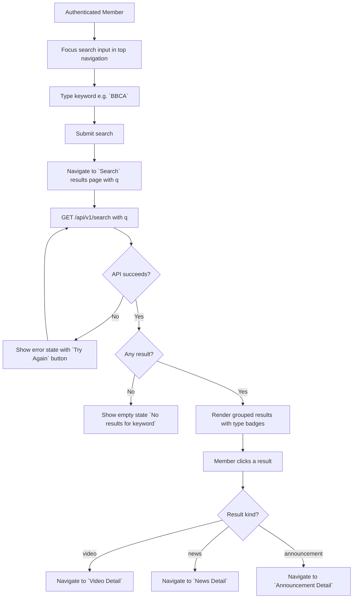
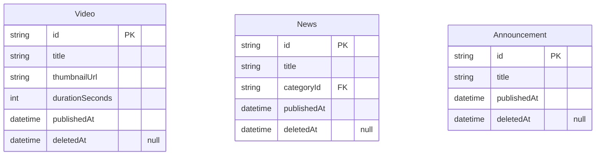
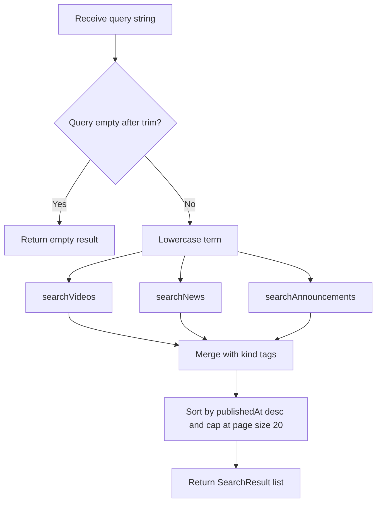

# Search v0

## Changelog Summary

- v0 · 2026-09-04 · Initial feature specification generated from `documentation/00.brief-early.md`.

## Objectives

### Overview

Basic search lets members find content by keyword (`documentation/00.brief-early.md` §10). The search input lives in the global top navigation so it is reachable from every page; submitting navigates to a results page that lists matching videos, news and announcements, each with a type badge and a link to its detail page.

Per the brief, search initially covers **titles only**: video titles, news titles and announcement titles. Content-body search is deferred.

Related features (specified separately): Video Detail, News and Announcement (result click targets), Video Library (owns video filtering by category — search here is cross-content).

Out of scope for v0: full-text/body search, fuzzy matching, search suggestions/autocomplete, search history, result filtering by category.

### User Flow



### Functional Requirements

| ID | Requirement |
|----|-------------|
| FR-001 | The search input is present in the top navigation on every authenticated page. |
| FR-002 | Submitting a non-empty keyword navigates to the results page; an empty keyword does nothing. |
| FR-003 | Search matches case-insensitively against video `title`, news `title` and announcement `title`. |
| FR-004 | Results are grouped by type in order video, news, announcement, each item showing its type badge (Video / News / Announcement), title and supporting line (duration + date for videos, date for others). |
| FR-005 | Video results link to Video Detail, news results to News detail, announcement results to Announcement detail. |
| FR-006 | Results are paginated, default page size 20 across all types combined; `Load More` appends the next page. |
| FR-007 | No matches shows the empty state `No results for {keyword}`. |
| FR-008 | While searching, result skeletons are shown. |

## Visual Specification

### Layout

```
+--------------------------------+
| Piranha [ BBCA    (Go) ]|
| Home  Videos  Updates  Profile |
+--------------------------------+
| Results for `BBCA`             |
+--------------------------------+
| VIDEO                          |
| BBCA Deep Dive                 |
| 18 min · Sep 5                 |
+--------------------------------+
| NEWS                           |
| Banking Sector Update          |
| Sep 7                          |
+--------------------------------+
| ANNOUNCEMENT                   |
| BBCA Special Coverage Tonight  |
| 2 hours ago                    |
+--------------------------------+
```

### UI Components

| Component | Source |
|-----------|--------|
| SearchInput | `src/components/ui/search-input.tsx` (custom, Tailwind) |
| SearchResultItem | `src/components/search/search-result-item.tsx` (custom, Tailwind) |
| TypeBadge | `src/components/ui/type-badge.tsx` (custom, Tailwind) |
| Skeleton | `src/components/ui/skeleton.tsx` (custom, Tailwind) |
| EmptyState | `src/components/ui/empty-state.tsx` (custom, Tailwind) |

### Responsive Behavior

| Platform | Description |
|----------|-------------|
| Desktop  | Search input in top navigation, results list max-width 720px centered |
| Tablet   | Same layout with 24px padding |
| Mobile   | Search input collapses to icon, expands to full-width bar; results full-width with 16px padding |

### States

| State     | Description |
| --------- | ----------- |
| Default   | Results page without `q` shows prompt `Search for videos, news and announcements` |
| Loading   | Result skeletons |
| Results   | Grouped results with type badges |
| Empty     | `No results for {keyword}` empty state |
| Error     | Error message with `Try Again` button |

## Acceptance Criteria

- [ ] Search input is reachable from every authenticated page
- [ ] Submitting `BBCA` returns videos, news and announcements with `BBCA` in the title
- [ ] Matching is case-insensitive and title-only
- [ ] Results are grouped video, news, announcement with correct type badges
- [ ] Each result navigates to its correct detail page
- [ ] No matches shows the empty state with the keyword echoed
- [ ] Empty keyword submission does not trigger a search

## Technical Specification

### Database Model

#### Entity Diagram



#### Schema

Search reads from the existing content models — no dedicated search index or table for v0:

```prisma
model Video {
  id              String        @id @default(uuid())
  title           String
  description     String
  videoUrl        String
  provider        VideoProvider @default(YOUTUBE)
  thumbnailUrl    String
  durationSeconds Int
  categoryId      String
  isFeatured      Boolean       @default(false)
  publishedAt     DateTime
  createdAt       DateTime      @default(now())
  updatedAt       DateTime      @updatedAt
  deletedAt       DateTime?

  @@index([publishedAt])
}

enum VideoProvider {
  UPLOAD
  VIMEO
  YOUTUBE
  OTHER
}

model News {
  id          String    @id @default(uuid())
  title       String
  summary     String
  content     String
  imageUrl    String?
  categoryId  String
  isFeatured  Boolean   @default(false)
  publishedAt DateTime
  createdAt   DateTime  @default(now())
  updatedAt   DateTime  @updatedAt
  deletedAt   DateTime?

  @@index([publishedAt])
}

model Announcement {
  id          String    @id @default(uuid())
  title       String
  content     String
  ctaLabel    String?
  ctaUrl      String?
  isFeatured  Boolean   @default(false)
  publishedAt DateTime
  createdAt   DateTime  @default(now())
  updatedAt   DateTime  @updatedAt
  deletedAt   DateTime?

  @@index([publishedAt])
}
```

### Context

#### Repository Layer

##### SearchRepository

```typescript
interface SearchRepository {
  searchVideos(term: string, limit: number): Promise<Video[]>;
  searchNews(term: string, limit: number): Promise<News[]>;
  searchAnnouncements(term: string, limit: number): Promise<Announcement[]>;
}
```

#### Service Layer

##### SearchService

```typescript
type SearchResult =
  | { kind: "video"; item: Video }
  | { kind: "news"; item: News }
  | { kind: "announcement"; item: Announcement };

interface SearchService {
  search(query: string): Promise<SearchResult[]>;
}
```

###### search Diagram



### API

#### GET /api/v1/search

```yaml
request:
  method: GET
  url: /api/v1/search
  header:
    "Authorization": "Bearer {accessToken}"
  query:
    q: string
response:
  200:
    data:
      - kind: video | news | announcement
        id: string
        title: string
        subtitle: string | "null"
        publishedAt: datetime
  400:
    error:
      - path: ["q"]
        message: general.error.validation
  401:
    error:
      - path: ["general"]
        message: general.error.unauthorized
  500:
    error:
      - path: ["general"]
        message: general.error.server_error
```

## Code Changelog

| Layer | File | Description |
|-------|------|-------------|
| Shared (types) | `src/features/search/search-types.ts` | `SearchResultItemDto` (`kind`, `id`, `title`, `subtitle`, `publishedAt`) and `searchQuerySchema` (zod: `q` trimmed 1-100 chars so missing/empty returns 400 `path: ["q"]`, `page` default 1; page added beyond the YAML to support FR-006 pagination) |
| Repository | `src/features/search/repository/search-repository.ts` | `SearchRepository` + `PrismaSearchRepository` — `searchVideos`/`searchNews`/`searchAnnouncements` matching `title` case-insensitively, soft-delete filtered, `publishedAt` desc, bounded by limit (FR-003) |
| Shared (mappers) | `src/features/search/search-mappers.ts` | Per-kind `SearchResultItemDto` mappers; `subtitle` composes the supporting line server-side (`18 min · Sep 7, 2026` for videos, date for others, FR-004) |
| Service | `src/features/search/service/search-service.ts` | `SearchService.search(query, page)` — trims (empty returns an empty page per the spec diagram), fetches the three types in parallel with a per-type limit of `page * pageSize`, merges with kind tags, sorts `publishedAt` desc and slices the combined page of 20 (FR-006) |
| API | `src/app/api/v1/search/route.ts` | `GET /api/v1/search?q=&page=` — Bearer auth, zod validation (400 `general.error.validation` on empty `q`), `{ data, pagination }` envelope (pagination added per FR-006) |
| UI Components | `src/components/layout/app-nav.tsx` | Global top navigation rendered by the new `src/app/(member)/layout.tsx` member route group on every authenticated page (FR-001): brand, search form with `Go` submit that navigates to `/search?q=` and does nothing on empty input (FR-002), Home/Videos/Updates/Profile links with active state |
| UI Components | `src/components/search/search-result-item.tsx` | Result row — type badge (`Video`/`News`/`Announcement`), title linking to Video/News/Announcement detail (FR-004/005), supporting line |
| Page | `src/app/(member)/search/page.tsx` | Search results page (async server component awaiting the `searchParams` promise); keyed by `q` so each search remounts the view with clean loading state |
| Page | `src/features/search/components/search-results-view.tsx` | Results client view — prompt when opened without `q`, result skeletons (FR-008), grouped video/news/announcement sections (FR-004), `No results for {keyword}` empty state (FR-007), `Load More` appending the next page (FR-006), error state with `Try Again`, 401 redirect |
| Service | `prisma/seed.ts` | Added the spec's examples as searchable content: news `BBCA Quarterly Results: What Stands Out` and announcement `BBCA Special Coverage Tonight`; content upserts now refresh titles on reseed so seed edits land |
