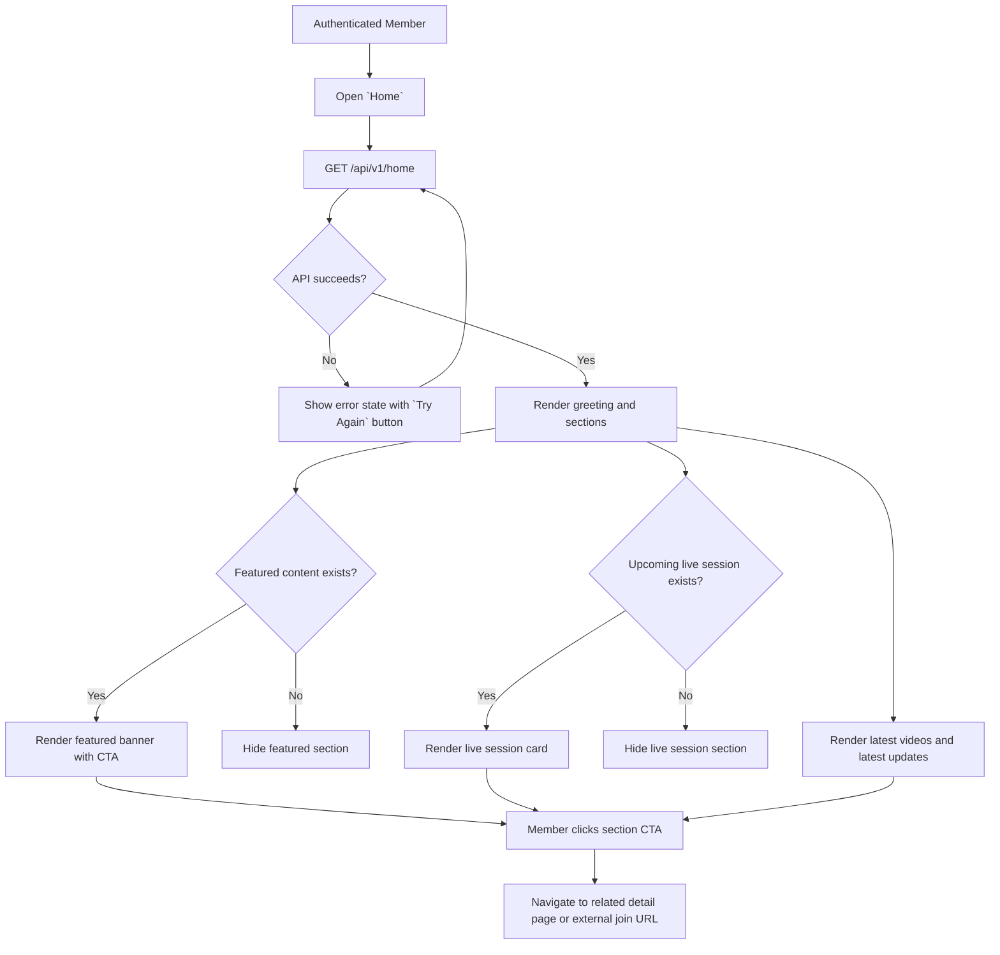
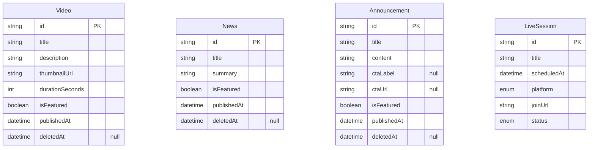
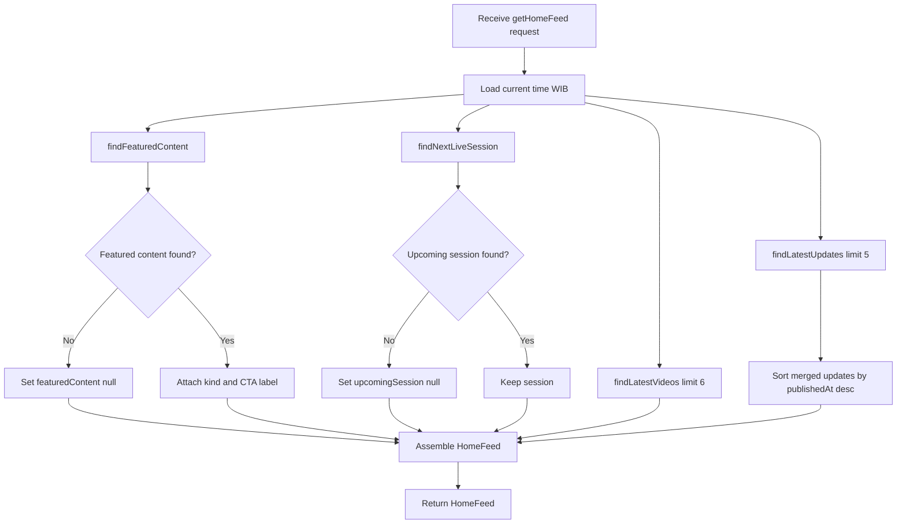

# Home Dashboard v0

## Changelog Summary

- v0 · 2026-09-04 · Initial feature specification generated from `documentation/00.brief-early.md`.
- v1 · 2026-09-09 · Dashboard rework — premium Indonesian market intelligence structure (market snapshot, Today's Briefing hero, What Matters Today, Stocks in Focus, Sector Pulse, redesigned Upcoming Live, Latest Market Insights), simplified navigation and placeholder market data. See "Rework" section below.

## Objectives

### Overview

Home is the first page members see after login (`documentation/00.brief-early.md` §4, §13). It aggregates four sections:

1. **Featured Content** — one prominent item (video, announcement or important news) selected by the Admin via the `isFeatured` flag.
2. **Upcoming Live Session** — the next scheduled external session (Zoom / Google Meet); the join button redirects externally, no hosted streaming (see Upcoming Live Session spec).
3. **Latest Videos** — most recently published videos as cards.
4. **Latest Updates** — most recent news and announcements merged in reverse-chronological order.

Related features (specified separately): Upcoming Live Session (data source of section 2), Video Library / Video Detail (latest videos link here), Updates Feed (latest updates link here), News and Announcement details (update items link here).

Out of scope for v0: member-personalized feeds, notifications, bookmarks.

### User Flow



### Functional Requirements

| ID | Requirement |
|----|-------------|
| FR-001 | Greeting text is time-based: `Good Morning` before 12:00, `Good Afternoon` 12:00–18:00, `Good Evening` after 18:00 (WIB). |
| FR-002 | Featured section shows exactly one item with `isFeatured = true`, most recent `publishedAt` wins across video / announcement / news. |
| FR-003 | Featured CTA is `Watch Now` for video, `Read More` for news, `View Details` for announcement, navigating to the corresponding detail page. |
| FR-004 | If no featured content exists the featured section is hidden. |
| FR-005 | Upcoming Live section shows the nearest `SCHEDULED` session with `scheduledAt` in the future, displaying title, weekday, time (WIB) and a `Join Session` button that opens `joinUrl` in a new tab. |
| FR-006 | If no upcoming session exists the live section is hidden. |
| FR-007 | Latest Videos shows the 6 most recent videos; each card shows thumbnail, title, short description (max 2 lines), duration and publish date, and links to Video Detail. |
| FR-008 | Latest Updates shows the 5 most recent items merged from news and announcements; each item shows type badge (Announcement / Market News / Video), title and relative time, and links to its detail page. |
| FR-009 | `View All Videos` navigates to Video Library, `View All Updates` navigates to Updates Feed. |

## Visual Specification

### Layout

```
+--------------------------------+
| Good Morning, Yoga      [Nav]  |
+--------------------------------+
|  [ FEATURED CONTENT ]          |
|  Weekly Market Outlook         |
|  Key themes to watch this week |
|  [Watch Now]                   |
+--------------------------------+
|  Upcoming Live                 |
|  Weekly Market Discussion      |
|  Wednesday · 19:00 WIB         |
|  [Join Session]                |
+--------------------------------+
|  Latest Videos                 |
|  [Card] [Card] [Card]          |
|  [Card] [Card] [Card]          |
|  [View All Videos]             |
+--------------------------------+
|  Latest Updates                |
|  Live Session Tonight          |
|  Banking Sector Update         |
|  [View All Updates]            |
+--------------------------------+
```

### UI Components

| Component | Source |
|-----------|--------|
| FeaturedBanner | `src/components/home/featured-banner.tsx` (custom, Tailwind) |
| LiveSessionCard | `src/components/live-sessions/live-session-card.tsx` (custom, Tailwind) |
| VideoCard | `src/components/videos/video-card.tsx` (custom, Tailwind) |
| UpdateListItem | `src/components/updates/update-list-item.tsx` (custom, Tailwind) |
| SectionHeader | `src/components/ui/section-header.tsx` (custom, Tailwind) |
| Button | `src/components/ui/button.tsx` (custom, Tailwind) |
| Skeleton | `src/components/ui/skeleton.tsx` (custom, Tailwind) |

### Responsive Behavior

| Platform | Description |
|----------|-------------|
| Desktop  | Content max-width 1200px, latest videos grid of 3 columns |
| Tablet   | Latest videos grid of 2 columns, same section order |
| Mobile   | Single column, videos grid of 1 column, featured banner stacks vertically |

### States

| State          | Description |
| -------------- | ----------- |
| Default        | All available sections rendered |
| Loading        | Section skeletons shown while fetching |
| Partial        | Featured and/or live section hidden when no data |
| Error          | Error message with `Try Again` button |
| Empty          | No videos and no updates at all — friendly empty message |

## Acceptance Criteria

- [ ] Greeting changes based on the member's local time of day
- [ ] Featured banner shows the latest item flagged as featured with the correct CTA label
- [ ] Featured section is hidden when nothing is flagged
- [ ] Upcoming live section shows the nearest future scheduled session with working external join link
- [ ] Live section is hidden when there is no upcoming session
- [ ] Latest videos shows up to 6 videos with thumbnail, title, description, duration and date
- [ ] Latest updates shows up to 5 merged news and announcements with type badges
- [ ] `View All Videos` and `View All Updates` navigate to the correct pages

## Technical Specification

### Database Model

#### Entity Diagram



#### Schema

```prisma
enum LiveSessionPlatform {
  ZOOM
  GOOGLE_MEET
  OTHER
}

enum LiveSessionStatus {
  SCHEDULED
  COMPLETED
  CANCELLED
}

model Video {
  id              String        @id @default(uuid())
  title           String
  description     String
  videoUrl        String
  provider        VideoProvider @default(YOUTUBE)
  thumbnailUrl    String
  durationSeconds Int
  categoryId      String
  isFeatured      Boolean       @default(false)
  publishedAt     DateTime
  createdAt       DateTime      @default(now())
  updatedAt       DateTime      @updatedAt
  deletedAt       DateTime?

  @@index([publishedAt])
}

enum VideoProvider {
  UPLOAD
  VIMEO
  YOUTUBE
  OTHER
}

model News {
  id          String    @id @default(uuid())
  title       String
  summary     String
  content     String
  imageUrl    String?
  categoryId  String
  isFeatured  Boolean   @default(false)
  publishedAt DateTime
  createdAt   DateTime  @default(now())
  updatedAt   DateTime  @updatedAt
  deletedAt   DateTime?

  @@index([publishedAt])
}

model Announcement {
  id          String    @id @default(uuid())
  title       String
  content     String
  ctaLabel    String?
  ctaUrl      String?
  isFeatured  Boolean   @default(false)
  publishedAt DateTime
  createdAt   DateTime  @default(now())
  updatedAt   DateTime  @updatedAt
  deletedAt   DateTime?

  @@index([publishedAt])
}

model LiveSession {
  id          String              @id @default(uuid())
  title       String
  description String?
  scheduledAt DateTime
  platform    LiveSessionPlatform
  joinUrl     String
  status      LiveSessionStatus   @default(SCHEDULED)
  createdAt   DateTime            @default(now())
  updatedAt   DateTime            @updatedAt
  deletedAt   DateTime?

  @@index([scheduledAt])
}
```

### Context

#### Repository Layer

##### DashboardRepository

```typescript
type FeaturedContent =
  | { kind: "video"; item: Video }
  | { kind: "announcement"; item: Announcement }
  | { kind: "news"; item: News };

interface DashboardRepository {
  findFeaturedContent(): Promise<FeaturedContent | null>;
  findNextLiveSession(now: Date): Promise<LiveSession | null>;
  findLatestVideos(limit: number): Promise<Video[]>;
  findLatestUpdates(limit: number): Promise<Array<{ kind: "news"; item: News } | { kind: "announcement"; item: Announcement }>>;
}
```

#### Service Layer

##### DashboardService

```typescript
interface HomeFeed {
  featuredContent: FeaturedContent | null;
  upcomingSession: LiveSession | null;
  latestVideos: Video[];
  latestUpdates: HomeFeedUpdate[];
}

interface HomeFeedUpdate {
  kind: "news" | "announcement";
  item: News | Announcement;
}

interface DashboardService {
  getHomeFeed(): Promise<HomeFeed>;
}
```

###### getHomeFeed Diagram



### API

#### GET /api/v1/home

```yaml
request:
  method: GET
  url: /api/v1/home
  header:
    "Authorization": "Bearer {accessToken}"
response:
  200:
    featuredContent:
      kind: video | announcement | news | "null"
      item: object | "null"
    upcomingSession:
      id: string | "null"
      title: string | "null"
      scheduledAt: datetime | "null"
      platform: ZOOM | GOOGLE_MEET | OTHER | "null"
      joinUrl: string | "null"
    latestVideos:
      - id: string
        title: string
        shortDescription: string
        thumbnailUrl: string
        durationSeconds: number
        publishedAt: datetime
    latestUpdates:
      - kind: news | announcement
        id: string
        title: string
        publishedAt: datetime
  401:
    error:
      - path: ["general"]
        message: general.error.unauthorized
  500:
    error:
      - path: ["general"]
        message: general.error.server_error
```

## Rework v1 — Premium Market Intelligence Dashboard (2026-09-09)

The dashboard was reworked from a generic content portal into a curated Indonesian market
intelligence membership view. A member should understand within seconds: what is happening
in the Indonesian market today, what Piranha thinks is important, and what to watch or read
next. Data provides context; Piranha's interpretation remains the product.

### Section hierarchy (top to bottom, content width capped at 1320px, centered)

| Order | Section | Source | Notes |
|-------|---------|--------|-------|
| 1 | Welcome Header | Stored user + client clock | Time-based greeting, name, date line (WIB), and an IDX Market Open/Closed chip (Mon-Fri, 09:00-12:00 and 13:30-15:50 WIB sessions). Compact. |
| 2 | Indonesia Market Snapshot | Placeholder data | Single compact panel: IHSG value with change chip, Turnover, Foreign Flow, Advancers/Decliners. Green/red tones for direction. |
| 3 | Today's Briefing (hero) | `featuredContent` from `GET /api/v1/home` | Replaces the old Featured Content banner. Two-column hero: kicker, large headline, standfirst, related ticker chips (placeholder), duration metadata, `Watch Briefing` primary button (normal size, not full width) and a `Read Summary` text link. Non-video featured kinds render without a thumbnail. |
| 4 | What Matters Today | Placeholder data | Three curated cards: numbered topic label, one-sentence interpretation, related tickers, `Read Insight` link. Curation, not news aggregation. |
| 5 | Stocks in Focus | Placeholder data | Four IDX stocks selected by Piranha: ticker, company, price, signed daily change, short thesis, optional Key Level, `View Analysis` link. Analysis-first; intentionally not a brokerage order card. |
| 6 | Sector Pulse | Placeholder data | Compact single panel listing sectors with signed percentage and Piranha's qualitative view chip (Positive / Neutral / Watch). |
| 7 | Upcoming Live | `upcomingSession` from the home API | Redesigned as an exclusive member event: host avatar, live-dot kicker, platform badge, title, `Weekday · HH:mm WIB` schedule, session description, live countdown (`1d 8h` format, minute refresh), `Add to Calendar` (Google Calendar template) and `Join Session` buttons. |
| 8 | Latest Market Insights | `latestVideos` from the home API | Renamed from "Latest Videos". Cards carry a `VIDEO` content-type label on the thumbnail. Mixed formats (market note, deep dive) require a content-type field in the data model and are deferred. |

Removed from the dashboard: the Latest Updates section (still available on `/updates`), the
empty-feed state, and the full-width green featured CTA.

Continue Watching is intentionally not built yet: it should only appear when viewing history
exists, which requires a playback-progress data model (deferred with Watchlist and
personalization).

### Placeholder market data

`src/features/home/market-data.ts` holds typed illustrative data (snapshot, briefing
tickers, insights, stocks in focus, sector pulse), marked as placeholder. Before production
these views need a real IDX market-data source; component contracts are stable so the data
source can be swapped without UI changes.

### Navigation rework

Sidebar simplified to a flat list — Home, Insights, Stocks, Videos, Live, Watchlist,
Profile — with Search removed (global search stays in the top bar, placeholder now
"Search stocks, insights, videos..."). New routes `/insights`, `/stocks`, `/live` and
`/watchlist` render "coming soon" empty states with a back-to-dashboard action. The Updates
page remains reachable at `/updates` and from search results; a future nav revision may
fold updates into Insights.

## Code Changelog

| Layer | File | Description |
|-------|------|-------------|
| Schema | `prisma/schema.prisma` | Added `Category`, `Video`, `News`, `Announcement`, `LiveSession` models with `VideoProviderKind` / `LiveSessionPlatformKind` / `LiveSessionStatusKind` enums per database convention (snake_case `@map`, `t_` tables, cuid, soft delete, `@@index`) |
| Schema | `prisma/migrations/20260907031127_add_content_models/` | Migration SQL creating the five content tables, applied via `prisma migrate dev` |
| Shared (Auth utils) | `src/lib/auth/jwt.ts` | Added `verifyAccessToken` (HS256 via `jose`, validates `sub` and `role` claims) |
| Shared (Auth utils) | `src/lib/auth/token-storage.ts` | Added stored user (`getStoredUser` / `setStoredUser`) so Home can greet by name, and `clearSession` clearing token and user together |
| Shared (API) | `src/lib/api/auth.ts` | `requireAuth` request guard — parses the `Authorization: Bearer` header, maps missing/invalid tokens to `general.error.unauthorized` (401) |
| Shared (utils) | `src/lib/datetime/format.ts` | WIB formatting helpers — time-based greeting (FR-001), `Weekday · HH:mm WIB` session schedule (FR-005), publish date, duration, relative time (FR-008) |
| Repository | `src/features/home/repository/dashboard-repository.ts` | `DashboardRepository` interface + `PrismaDashboardRepository` — featured pick across video/announcement/news by most recent `publishedAt` (FR-002), nearest future `SCHEDULED` session (FR-005), latest videos, merged news+announcements sorted desc (FR-008), all excluding soft-deleted rows |
| Service | `src/features/home/home-types.ts` | API-facing DTOs (`HomeFeed`, `FeaturedContent`, `UpcomingSession`, `HomeFeedVideo`, `HomeFeedUpdate`) with ISO datetime strings |
| Service | `src/features/home/service/dashboard-service.ts` | `DashboardService` interface + `DashboardServiceImpl` — parallel fetch, null-if-missing featured/session, attaches CTA label per FR-003, truncates short descriptions, maps news badge to category name per `getHomeFeed` diagram |
| API | `src/app/api/v1/home/route.ts` | `GET /api/v1/home` — `requireAuth` then service call; 200 / 401 / 500 per API spec |
| Page | `src/app/page.tsx` | Replaced scaffold with the Home dashboard page (server component + metadata) |
| Page | `src/features/home/components/home-dashboard.tsx` | Dashboard client component — greeting, loading skeletons, error state with `Try Again`, empty state, section hide/show per FR-004 / FR-006, redirect to Login on 401 |
| UI Components | `src/components/home/featured-banner.tsx` | FeaturedBanner — kind-aware description and CTA (FR-003) |
| UI Components | `src/components/live-sessions/live-session-card.tsx` | LiveSessionCard — title, weekday/time WIB, `Join Session` opening `joinUrl` in a new tab (FR-005) |
| UI Components | `src/components/videos/video-card.tsx` | VideoCard — thumbnail, title, 2-line description, duration badge, publish date (FR-007) |
| UI Components | `src/components/updates/update-list-item.tsx` | UpdateListItem — type badge, title, relative time (FR-008) |
| UI Components | `src/components/ui/section-header.tsx` | SectionHeader with optional `View All` action link (FR-009) |
| UI Components | `src/components/ui/skeleton.tsx` | Loading skeleton used by the dashboard loading state |
| UI Components | `src/components/ui/button.tsx` | Added `ButtonLink` (next/link with button styles) for banner/session CTAs |
| Config | `next.config.ts` | Allowed `picsum.photos` image remote pattern for seed video thumbnails |
| Page | `src/features/auth/components/login-form.tsx` | Stores the authenticated user (name) alongside the token for the Home greeting |
| Service | `prisma/seed.ts` | Extended idempotent seed — 6 categories, 3 videos (1 featured), featured-adjacent announcement, 2 news items, live session on the next Wednesday 19:00 WIB |
| Data (v1) | `src/features/home/market-data.ts` | Typed placeholder market data (snapshot, briefing tickers, Today's Matters insights, Stocks in Focus, Sector Pulse) marked illustrative pending a real IDX data source |
| UI (v1) | `src/components/home/welcome-header.tsx` | WelcomeHeader — greeting, WIB date line, IDX Market Open/Closed chip (session hours, client clock read deferred post-mount to keep SSR markup stable) |
| UI (v1) | `src/components/home/market-snapshot.tsx` | MarketSnapshot — compact IHSG panel with change chip, Turnover, Foreign Flow, Adv/Dec stats |
| UI (v1) | `src/components/home/briefing-hero.tsx` | BriefingHero — Today's Briefing hero replacing FeaturedBanner; ticker chips, duration meta, normal-size primary CTA plus Read Summary link; video thumbnail or non-video panel |
| UI (v1) | `src/components/home/what-matters.tsx` | WhatMattersToday — three numbered curated insight cards with topic, statement, tickers and Read Insight links |
| UI (v1) | `src/components/home/stocks-in-focus.tsx` | StocksInFocus — analysis-first IDX stock cards (price, signed change, thesis, Key Level, View Analysis) |
| UI (v1) | `src/components/home/sector-pulse.tsx` | SectorPulse — compact sector panel with signed change and qualitative view chips (Positive / Neutral / Watch) |
| UI (v1) | `src/components/home/upcoming-live.tsx` | UpcomingLive — member-event card with host avatar, live-dot kicker, countdown (minute interval), Google Calendar template link, secondary Add to Calendar and primary Join Session; replaces LiveSessionCard |
| UI (v1) | `src/components/videos/video-card.tsx` | Added optional `typeLabel` thumbnail badge for content-type labels on Latest Market Insights cards |
| UI (v1) | `src/components/ui/button.tsx` | Added `variant: "secondary"` (panel-raised surface, edge border) for non-primary actions such as Add to Calendar |
| Shared (v1) | `src/lib/datetime/format.ts` | Added `formatPrice` (en-US grouping) for index values and stock prices |
| Page (v1) | `src/features/home/components/home-dashboard.tsx` | Rewired to the v1 hierarchy at 1320px max width; Latest Updates section removed; Latest Videos renamed Latest Market Insights with VIDEO labels |
| Page (v1) | `src/components/layout/app-shell.tsx` | Sidebar flattened to Home / Insights / Stocks / Videos / Live / Watchlist / Profile; Search entry removed; topbar search placeholder updated to "Search stocks, insights, videos..."; page-title rules extended for the new routes |
| Page (v1) | `src/app/(member)/{insights,stocks,live,watchlist}/page.tsx` | New "coming soon" stub routes with metadata and back-to-dashboard actions so the simplified navigation resolves |
| Cleanup (v1) | `src/components/home/featured-banner.tsx`, `src/components/live-sessions/live-session-card.tsx` | Deleted — replaced by BriefingHero and UpcomingLive |
