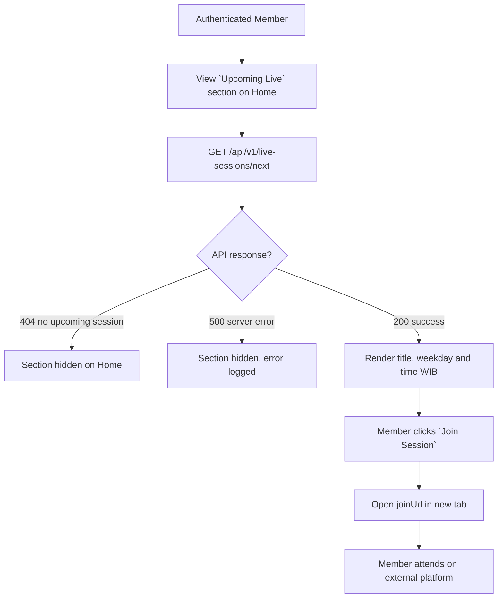
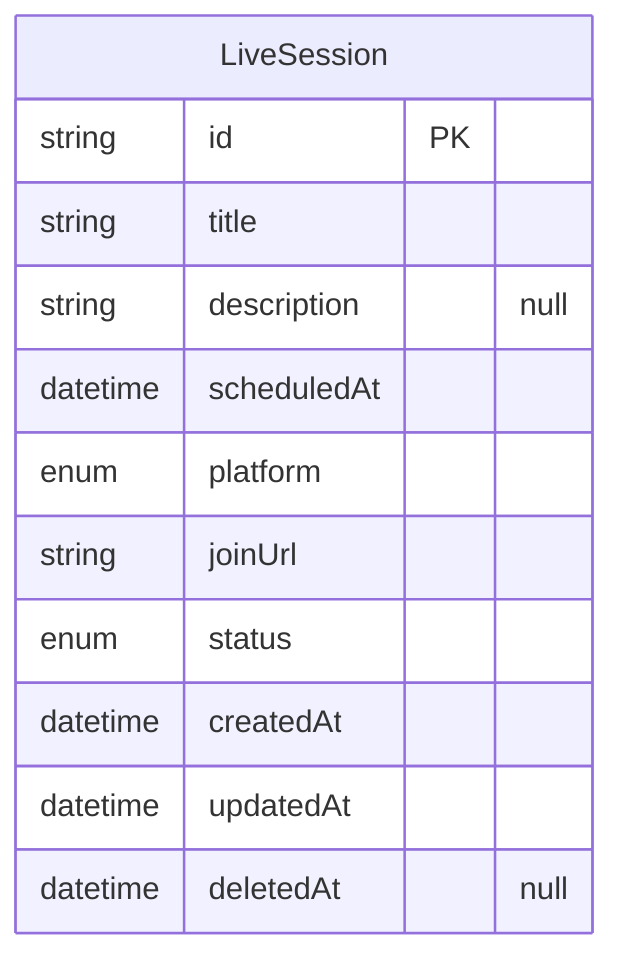
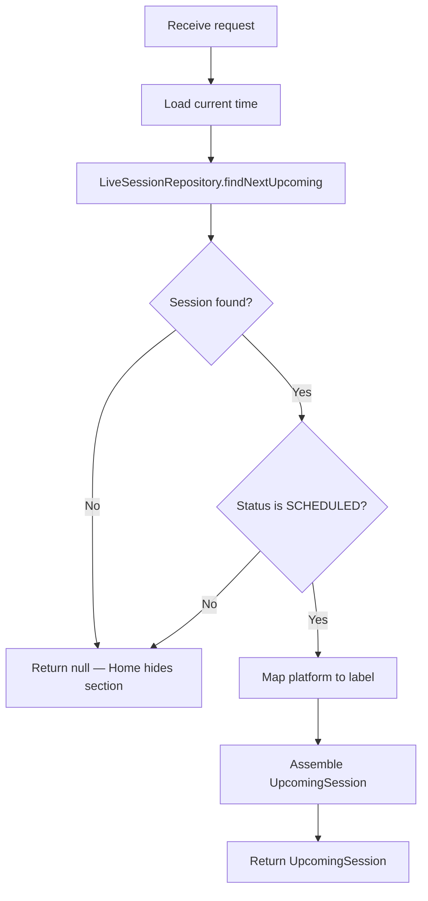

# Upcoming Live Session v0

## Changelog Summary

- v0 · 2026-09-04 · Initial feature specification generated from `documentation/00.brief-early.md`.

## Objectives

### Overview

The Upcoming Live Session feature surfaces the next scheduled Zoom / Google Meet session to members (`documentation/00.brief-early.md` §2, §4). The primary surface is the **Upcoming Live** section on Home; the data and service layer of this spec is the single source for it.

For MVP the platform does **not** host live streaming — the `Join Session` button redirects to the external meeting URL (`joinUrl` on Zoom, Google Meet or another platform).

Session creation and management belong to the Admin (brief §2: "manage upcoming live sessions") and are deferred to the Admin epic, which needs product input. This spec covers the member-facing read path only.

Related features (specified separately): Home Dashboard (renders the section using this data), Announcement (announcements may reference sessions via CTA), Login (protected access).

Out of scope for v0: session registration/RSVP, calendar file export, reminders/notifications, past-session archive, hosting.

### User Flow



### Functional Requirements

| ID | Requirement |
|----|-------------|
| FR-001 | `GET /api/v1/live-sessions/next` returns the `SCHEDULED` session with the earliest `scheduledAt` strictly in the future. |
| FR-002 | When no such session exists the API returns 404 and the Home section is hidden. |
| FR-003 | The section shows the session title, weekday name and time formatted in WIB (e.g. `Wednesday · 19:00 WIB`). |
| FR-004 | The `Join Session` button opens `joinUrl` in a new tab. |
| FR-005 | Sessions with status `COMPLETED` or `CANCELLED`, or `scheduledAt` in the past, are never returned. |
| FR-006 | The section is accessible only to authenticated members. |
| FR-007 | The platform is displayed with a recognizable label: `Zoom`, `Google Meet` or `Other` per the `platform` enum. |

## Visual Specification

### Layout

```
+--------------------------------+
|  Upcoming Live                 |
|                                |
|  Weekly Market Discussion      |
|  Wednesday · 19:00 WIB         |
|  (Zoom)                        |
|                                |
|  [     Join Session       ]    |
+--------------------------------+
```

### UI Components

| Component | Source |
|-----------|--------|
| LiveSessionCard | `src/components/live-sessions/live-session-card.tsx` (custom, Tailwind) |
| PlatformBadge | `src/components/ui/platform-badge.tsx` (custom, Tailwind) |
| Button | `src/components/ui/button.tsx` (custom, Tailwind) |

### Responsive Behavior

| Platform | Description |
|----------|-------------|
| Desktop  | Card within Home column, max-width 1200px |
| Tablet   | Same card layout |
| Mobile   | Full-width card, 16px padding, join button full-width |

### States

| State       | Description |
| ----------- | ----------- |
| Default     | Next upcoming session rendered with join button |
| No Session  | 404 — section hidden on Home |
| Loading     | Card skeleton while fetching |
| Joined      | External tab opened; page state unchanged |

## Acceptance Criteria

- [ ] The nearest future scheduled session is returned and rendered
- [ ] Weekday and time render correctly in WIB
- [ ] `Join Session` opens the external meeting URL in a new tab
- [ ] Past, completed and cancelled sessions are never shown
- [ ] With no upcoming session the section is hidden
- [ ] Unauthenticated visitors cannot fetch the session data

## Technical Specification

### Database Model

#### Entity Diagram



#### Schema

```prisma
enum LiveSessionPlatform {
  ZOOM
  GOOGLE_MEET
  OTHER
}

enum LiveSessionStatus {
  SCHEDULED
  COMPLETED
  CANCELLED
}

model LiveSession {
  id          String              @id @default(uuid())
  title       String
  description String?
  scheduledAt DateTime
  platform    LiveSessionPlatform
  joinUrl     String
  status      LiveSessionStatus   @default(SCHEDULED)
  createdAt   DateTime            @default(now())
  updatedAt   DateTime            @updatedAt
  deletedAt   DateTime?

  @@index([scheduledAt])
}
```

### Context

#### Repository Layer

##### LiveSessionRepository

```typescript
interface LiveSessionRepository {
  findNextUpcoming(now: Date): Promise<LiveSession | null>;
}
```

#### Service Layer

##### LiveSessionService

```typescript
interface LiveSessionService {
  getNextUpcomingSession(): Promise<UpcomingSession | null>;
}

interface UpcomingSession {
  id: string;
  title: string;
  scheduledAt: Date;
  platform: LiveSessionPlatform;
  platformLabel: string;
  joinUrl: string;
}
```

###### getNextUpcomingSession Diagram



### API

#### GET /api/v1/live-sessions/next

```yaml
request:
  method: GET
  url: /api/v1/live-sessions/next
  header:
    "Authorization": "Bearer {accessToken}"
response:
  200:
    data:
      id: string
      title: string
      scheduledAt: datetime
      platform: ZOOM | GOOGLE_MEET | OTHER
      platformLabel: string
      joinUrl: string
  401:
    error:
      - path: ["general"]
        message: general.error.unauthorized
  404:
    error:
      - path: ["general"]
        message: general.error.not_found
  500:
    error:
      - path: ["general"]
        message: general.error.server_error
```

## Code Changelog

| Layer | File | Description |
|-------|------|-------------|
| Shared (types) | `src/features/live-sessions/live-session-types.ts` | `UpcomingSessionDto` per API spec plus `toPlatformLabel` mapping `ZOOM`/`GOOGLE_MEET`/`OTHER` to `Zoom`/`Google Meet`/`Other` (FR-007) |
| Repository | `src/features/live-sessions/repository/live-session-repository.ts` | `LiveSessionRepository` + `PrismaLiveSessionRepository` — `findNextUpcoming(now)` returns the earliest `SCHEDULED` session with `scheduledAt` strictly in the future, soft-delete filtered (FR-001/005) |
| Shared (mappers) | `src/features/live-sessions/live-session-mappers.ts` | `toUpcomingSessionDto` — ISO `scheduledAt` plus the resolved platform label |
| Service | `src/features/live-sessions/service/live-session-service.ts` | `LiveSessionService.getNextUpcomingSession()` returns the DTO or `null` per the spec diagram; the route translates `null` to the spec'd 404 (FR-002) |
| API | `src/app/api/v1/live-sessions/next/route.ts` | `GET /api/v1/live-sessions/next` — Bearer auth (FR-006), `{ data }` envelope, 404 `general.error.not_found` when no upcoming session |
| UI Components | `src/components/ui/platform-badge.tsx` | Platform label badge per the spec component list (FR-007) |
| UI Components | `src/components/live-sessions/live-session-card.tsx` | Card now renders the shared DTO: platform badge, title, `Wednesday · 19:00 WIB` schedule line (FR-003) and `Join Session` opening `joinUrl` in a new tab (FR-004) |
| Service | `src/features/home/service/dashboard-service.ts` | Home's Upcoming Live section now consumes `LiveSessionService` as the single source (spec Overview); the duplicated query was removed from `DashboardRepository` |
| Shared (types) | `src/features/home/home-types.ts` | `UpcomingSession` is now an alias of the shared `UpcomingSessionDto` (adds `platformLabel`) |
| Service | `prisma/seed.ts` | Weekly Zoom session seeded via `nextWednesday1900Wib()` (next Wednesday 19:00 WIB) so the section always has a future session |
