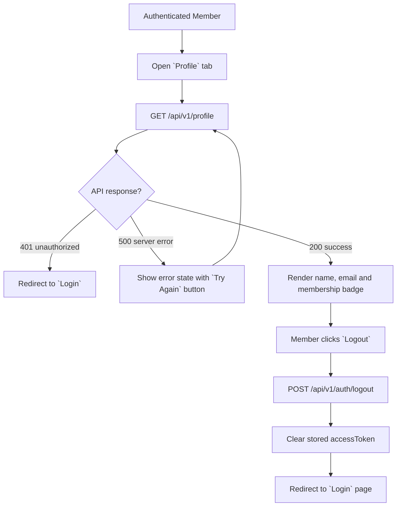
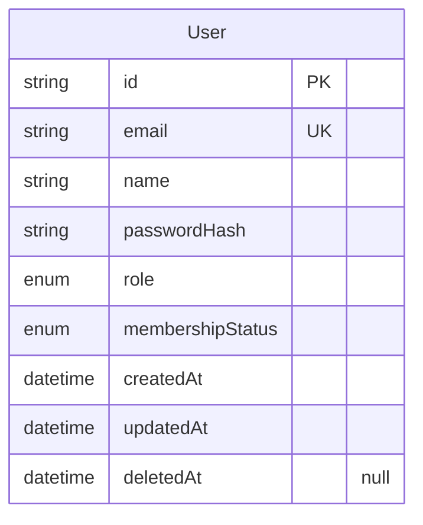
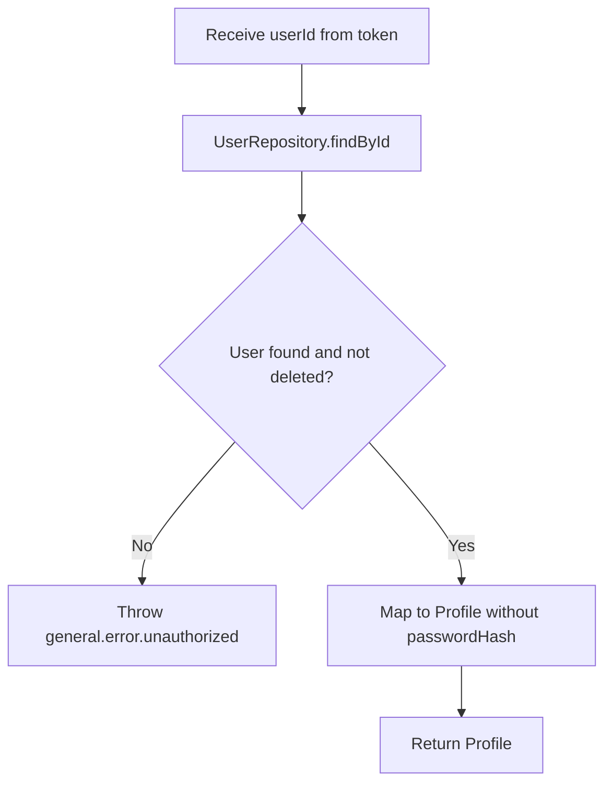

# Profile v0

## Changelog Summary

- v0 · 2026-09-04 · Initial feature specification generated from `documentation/00.brief-early.md`.

## Objectives

### Overview

Profile is the member's account page (`documentation/00.brief-early.md` §12). It shows the minimum profile information — name, email and membership status — and provides Logout. Members arrive from the bottom navigation (`Profile`).

Logout ends the member session by discarding the access token client-side and redirecting to Login. Server-side token revocation is not required for MVP.

Related features (specified separately): Login (session creation, counterpart of Logout), Home Dashboard (post-login landing).

More advanced profile functionality (avatar, edit name/password, membership history) is deferred per the brief.

Out of scope for v0: profile editing, avatar upload, password change, membership purchase/renewal.

### User Flow



### Functional Requirements

| ID | Requirement |
|----|-------------|
| FR-001 | The page shows the member's name, email and membership status as a badge (`Active`, `Inactive`, `Expired`). |
| FR-002 | The `Active` badge is styled positively; `Inactive` and `Expired` are styled as warnings. |
| FR-003 | `Logout` calls the logout endpoint, clears the stored access token from the client and redirects to the Login page. |
| FR-004 | If the profile request returns 401 (expired/invalid token), the member is redirected to Login. |
| FR-005 | After logout, protected pages are no longer accessible until login again. |
| FR-006 | The page is accessible only to authenticated members. |

## Visual Specification

### Layout

```
+--------------------------------+
| Profile                 [Nav]  |
+--------------------------------+
|           ( Avatar )           |
|        Yoga Wigardo            |
|       yoga@email.com           |
+--------------------------------+
|  Membership                    |
|  (Active)                      |
+--------------------------------+
|  [         Logout         ]    |
+--------------------------------+
```

### UI Components

| Component | Source |
|-----------|--------|
| Avatar | `src/components/ui/avatar.tsx` (custom, Tailwind — initials fallback) |
| StatusBadge | `src/components/ui/status-badge.tsx` (custom, Tailwind) |
| Button | `src/components/ui/button.tsx` (custom, Tailwind) |
| Skeleton | `src/components/ui/skeleton.tsx` (custom, Tailwind) |

### Responsive Behavior

| Platform | Description |
|----------|-------------|
| Desktop  | Centered card, max-width 420px |
| Tablet   | Same layout, card at 90% width |
| Mobile   | Full-width card with 16px padding, full-width logout button |

### States

| State       | Description |
| ----------- | ----------- |
| Default     | Name, email and membership badge rendered |
| Loading     | Profile skeleton |
| Unauthorized | 401 — redirect to Login |
| Error       | Error message with `Try Again` button |
| Logged Out  | Token cleared, redirected to Login |

## Acceptance Criteria

- [ ] Member sees their own name and email
- [ ] Membership status renders as a badge with correct styling per status
- [ ] Logout clears the stored access token
- [ ] Logout redirects to the Login page
- [ ] Protected pages redirect to Login after logout
- [ ] Expired token while viewing the page redirects to Login

## Technical Specification

### Database Model

#### Entity Diagram



#### Schema

```prisma
enum UserRole {
  MEMBER
  ADMIN
}

enum MembershipStatus {
  ACTIVE
  INACTIVE
  EXPIRED
}

model User {
  id               String           @id @default(uuid())
  email            String           @unique
  name             String
  passwordHash     String
  role             UserRole         @default(MEMBER)
  membershipStatus MembershipStatus @default(ACTIVE)
  createdAt        DateTime         @default(now())
  updatedAt        DateTime         @updatedAt
  deletedAt        DateTime?
}
```

### Context

#### Repository Layer

##### UserRepository

```typescript
interface UserRepository {
  findById(id: string): Promise<User | null>;
}
```

#### Service Layer

##### ProfileService

```typescript
interface ProfileService {
  getProfile(userId: string): Promise<Profile>;
}

interface Profile {
  id: string;
  name: string;
  email: string;
  membershipStatus: MembershipStatus;
}
```

###### getProfile Diagram



### API

#### GET /api/v1/profile

```yaml
request:
  method: GET
  url: /api/v1/profile
  header:
    "Authorization": "Bearer {accessToken}"
response:
  200:
    data:
      id: string
      name: string
      email: string
      membershipStatus: ACTIVE | INACTIVE | EXPIRED
  401:
    error:
      - path: ["general"]
        message: general.error.unauthorized
  500:
    error:
      - path: ["general"]
        message: general.error.server_error
```

#### POST /api/v1/auth/logout

```yaml
request:
  method: POST
  url: /api/v1/auth/logout
  header:
    "Authorization": "Bearer {accessToken}"
response:
  204: {}
  401:
    error:
      - path: ["general"]
        message: general.error.unauthorized
```

## Code Changelog

| Layer | File | Description |
|-------|------|-------------|
| Shared (types) | `src/features/profile/profile-types.ts` | `ProfileDto` (`id`, `name`, `email`, `membershipStatus`) per the API spec |
| Repository | `src/features/profile/repository/user-repository.ts` | `UserRepository` + `PrismaUserRepository` — `findById` soft-delete filtered, separate from the auth login repository |
| Service | `src/features/profile/service/profile-service.ts` | `ProfileService.getProfile(userId)` — missing/deleted user throws `AppError(401, general.error.unauthorized)` per the spec diagram; `passwordHash` never leaves the mapper (FR-001) |
| API | `src/app/api/v1/profile/route.ts` | `GET /api/v1/profile` — `requireAuth` returns the token claims and `claims.sub` identifies the user (FR-004/006); `{ data }` envelope |
| API | `src/app/api/v1/auth/logout/route.ts` | `POST /api/v1/auth/logout` — Bearer auth, returns 204; stateless JWT means the server holds nothing to revoke, the client discards its token (FR-003) |
| UI Components | `src/components/ui/avatar.tsx` | Initials avatar derived from the name (up to two initials) |
| UI Components | `src/components/ui/status-badge.tsx` | Badge with positive/warning tones — `Active` positive, `Inactive`/`Expired` warning (FR-002) |
| Page | `src/app/(member)/profile/page.tsx` | Profile page inside the member route group (nav layout) |
| Page | `src/features/profile/components/profile-view.tsx` | Profile client view — skeleton (Loading), name/email/avatar card, membership badge (FR-001/002), error state with `Try Again`; `Logout` calls the endpoint then `clearSession()` and redirects to Login even if the call fails (FR-003); 401 redirects to Login (FR-004); protected pages re-check the token on every fetch, so they become inaccessible after logout (FR-005) |
| Shared (API) | `src/components/layout/app-nav.tsx` | Profile reachable from the new global top navigation (member route-group layout) |
