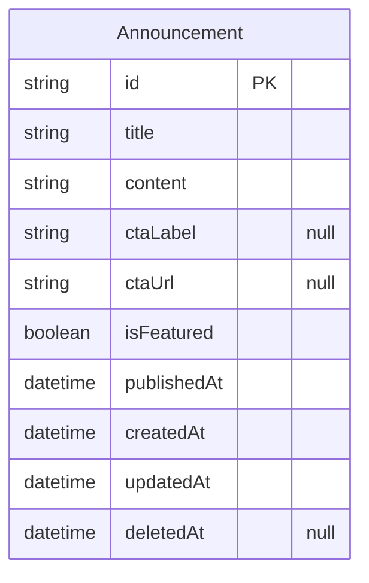
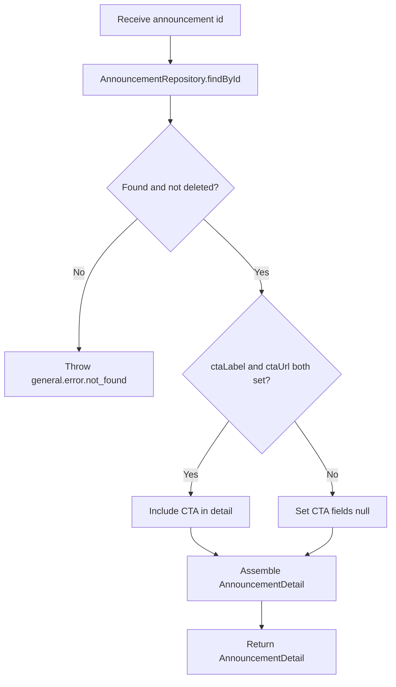

# Announcement v0

## Changelog Summary

- v0 · 2026-09-04 · Initial feature specification generated from `documentation/00.brief-early.md`.

## Objectives

### Overview

Announcements communicate important information directly to members (`documentation/00.brief-early.md` §9): live session schedules, event reminders, platform maintenance, new community features, special sessions and membership information. The list lives inside the Updates feed (with the `Announcement` filter); clicking an item opens the announcement detail page, which may render a CTA button (`Join Session`, `Register`, `Read More`, `View Schedule`).

Announcements do not use the Category taxonomy — their type is their category, keeping the system simple for MVP (`documentation/00.brief-early.md` §11).

Related features (specified separately): Updates Feed (owns the merged list UI), News (sibling content type), Home Dashboard (featured content can be an announcement; latest updates preview), Upcoming Live Session (a common CTA target), Search (announcement titles are searchable).

Out of scope for v0: authoring/publishing UI (Admin epic, needs product input), announcement read receipts, push/email delivery.

### User Flow

```mermaid
flowchart TD
    A[Authenticated Member] --> B[Open announcement from Updates, Home or Search]
    B --> C[GET /api/v1/announcements/{id}]
    C --> D{API response?}
    D -->|404 not found| E[Show `Announcement not found` empty state with back link]
    D -->|500 server error| F[Show error state with `Try Again` button]
    F --> C
    D -->|200 success| G[Render ANNOUNCEMENT badge, title and date]
    G --> H[Render full content]
    H --> I{ctaLabel and ctaUrl present?}
    I -->|Yes| J[Render CTA button]
    J --> K[Member clicks CTA]
    K --> L[Open ctaUrl in new tab]
    I -->|No| M[No CTA button rendered]
```

### Functional Requirements

| ID | Requirement |
|----|-------------|
| FR-001 | The detail page shows the `ANNOUNCEMENT` badge, title, publish date and full `content`. |
| FR-002 | When both `ctaLabel` and `ctaUrl` exist, a CTA button is rendered with `ctaLabel` as its text; otherwise no button is rendered. |
| FR-003 | The CTA opens `ctaUrl` in a new tab (external destinations such as Zoom or Google Meet). |
| FR-004 | The list representation (consumed by Updates Feed and Home) shows badge, title, snippet and relative publish time. |
| FR-005 | A non-existent or deleted announcement id renders `Announcement not found` (HTTP 404). |
| FR-006 | The page is accessible only to authenticated members; unauthenticated visitors are redirected to Login. |
| FR-007 | A back affordance returns the member to where they came from (Updates feed by default). |

## Visual Specification

### Layout

```
+--------------------------------+
| ← Back to Updates       [Nav]  |
+--------------------------------+
| ANNOUNCEMENT                   |
|                                |
| Live Session Tonight           |
|                                |
| Sep 6 · 2 hours ago            |
|                                |
| Join the weekly market         |
| discussion at 19:00 WIB.       |
|                                |
| [    Join Session     ]        |
+--------------------------------+
```

### UI Components

| Component | Source |
|-----------|--------|
| TypeBadge | `src/components/ui/type-badge.tsx` (custom, Tailwind) |
| ArticleBody | `src/components/updates/article-body.tsx` (custom, Tailwind) |
| Button | `src/components/ui/button.tsx` (custom, Tailwind) |
| EmptyState | `src/components/ui/empty-state.tsx` (custom, Tailwind) |
| Skeleton | `src/components/ui/skeleton.tsx` (custom, Tailwind) |

### Responsive Behavior

| Platform | Description |
|----------|-------------|
| Desktop  | Article column max-width 720px, centered |
| Tablet   | Same layout with 24px padding |
| Mobile   | Full-width article, 16px padding, CTA button full-width |

### States

| State     | Description |
| --------- | ----------- |
| Default   | Announcement rendered with all available fields |
| No CTA    | CTA button hidden when `ctaLabel` or `ctaUrl` is missing |
| Loading   | Article skeleton |
| Not Found | `Announcement not found` empty state with back to Updates link |
| Error     | Error message with `Try Again` button |

## Acceptance Criteria

- [ ] Announcement detail shows badge, title, publish date and full content
- [ ] CTA button renders with the stored label only when label and URL both exist
- [ ] CTA opens the external URL in a new tab
- [ ] Unknown or deleted announcement id shows the `Announcement not found` state
- [ ] Unauthenticated visitors are redirected to Login
- [ ] Back navigation returns to the previous page

## Technical Specification

### Database Model

#### Entity Diagram



#### Schema

```prisma
model Announcement {
  id          String    @id @default(uuid())
  title       String
  content     String
  ctaLabel    String?
  ctaUrl      String?
  isFeatured  Boolean   @default(false)
  publishedAt DateTime
  createdAt   DateTime  @default(now())
  updatedAt   DateTime  @updatedAt
  deletedAt   DateTime?

  @@index([publishedAt])
}
```

### Context

#### Repository Layer

##### AnnouncementRepository

```typescript
interface AnnouncementRepository {
  findById(id: string): Promise<Announcement | null>;
  findMany(page: number, pageSize: number): Promise<PaginatedResult<Announcement>>;
}
```

#### Service Layer

##### AnnouncementService

```typescript
interface AnnouncementService {
  getAnnouncementById(id: string): Promise<AnnouncementDetail>;
  listAnnouncements(page: number, pageSize: number): Promise<PaginatedResult<AnnouncementSummary>>;
}

interface AnnouncementDetail {
  id: string;
  title: string;
  content: string;
  ctaLabel: string | null;
  ctaUrl: string | null;
  publishedAt: Date;
}

interface AnnouncementSummary {
  id: string;
  title: string;
  snippet: string;
  publishedAt: Date;
}
```

###### getAnnouncementById Diagram



### API

#### GET /api/v1/announcements

```yaml
request:
  method: GET
  url: /api/v1/announcements
  header:
    "Authorization": "Bearer {accessToken}"
  query:
    page: number
    pageSize: number
response:
  200:
    data:
      - id: string
        title: string
        snippet: string
        publishedAt: datetime
    pagination:
      page: number
      pageSize: number
      totalItems: number
      totalPages: number
  401:
    error:
      - path: ["general"]
        message: general.error.unauthorized
  500:
    error:
      - path: ["general"]
        message: general.error.server_error
```

#### GET /api/v1/announcements/{id}

```yaml
request:
  method: GET
  url: /api/v1/announcements/{id}
  header:
    "Authorization": "Bearer {accessToken}"
response:
  200:
    data:
      id: string
      title: string
      content: string
      ctaLabel: string | "null"
      ctaUrl: string | "null"
      publishedAt: datetime
  401:
    error:
      - path: ["general"]
        message: general.error.unauthorized
  404:
    error:
      - path: ["general"]
        message: general.error.not_found
  500:
    error:
      - path: ["general"]
        message: general.error.server_error
```

## Code Changelog

| Layer | File | Description |
|-------|------|-------------|
| Shared (types) | `src/features/updates/update-types.ts` | `AnnouncementSummaryDto` (FR-004) and `AnnouncementDetailDto` (FR-001/002) with nullable `ctaLabel`/`ctaUrl` |
| Repository | `src/features/updates/repository/announcement-repository.ts` | `AnnouncementRepository` + `PrismaAnnouncementRepository` — `findById` and `findMany` offset pagination, soft-delete filtered, `publishedAt` desc |
| Shared (mappers) | `src/features/updates/update-mappers.ts` | `toAnnouncementSummaryDto` / `toAnnouncementDetailDto` — CTA fields are passed through only when both are set (both-or-null keeps FR-002/003 coherent if one is ever blank) |
| Service | `src/features/updates/service/announcement-service.ts` | `getAnnouncementById` throws `AppError(404, general.error.not_found)` for missing/deleted announcements (FR-005); `listAnnouncements` backs the list representation for FR-004 consumers |
| API | `src/app/api/v1/announcements/route.ts` | `GET /api/v1/announcements` — Bearer auth, page/pageSize defaults 1/12, `{ data, pagination }` envelope |
| API | `src/app/api/v1/announcements/[id]/route.ts` | `GET /api/v1/announcements/:id` — Bearer auth (FR-006), `{ data }` envelope, 404 error envelope (FR-005) |
| Page | `src/app/updates/announcements/[id]/page.tsx` | Announcement detail page (async server component awaiting the `params` promise) |
| Page | `src/features/updates/components/announcement-detail-view.tsx` | Detail client view — `Announcement` badge, title, absolute + relative dates, formatted body (FR-001); CTA `ButtonLink` rendered only when both CTA fields exist, opens `ctaUrl` in a new tab with `rel="noopener noreferrer"` (FR-002/003); `Announcement not found` empty state (FR-005); `Back to Updates` link (FR-007, static feed target); 401 redirect (FR-006) |
| UI Components | `src/components/ui/type-badge.tsx` | `TypeBadge` for the `Announcement` label (FR-001/004) |
