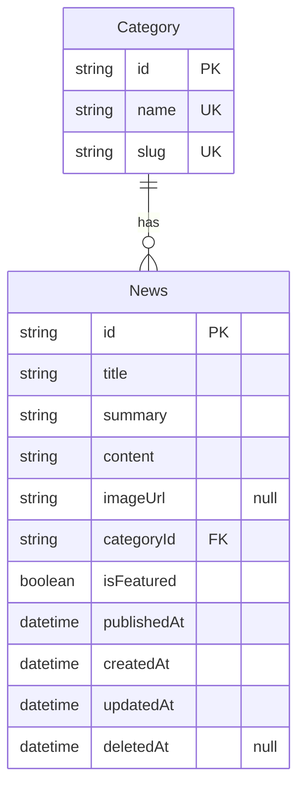
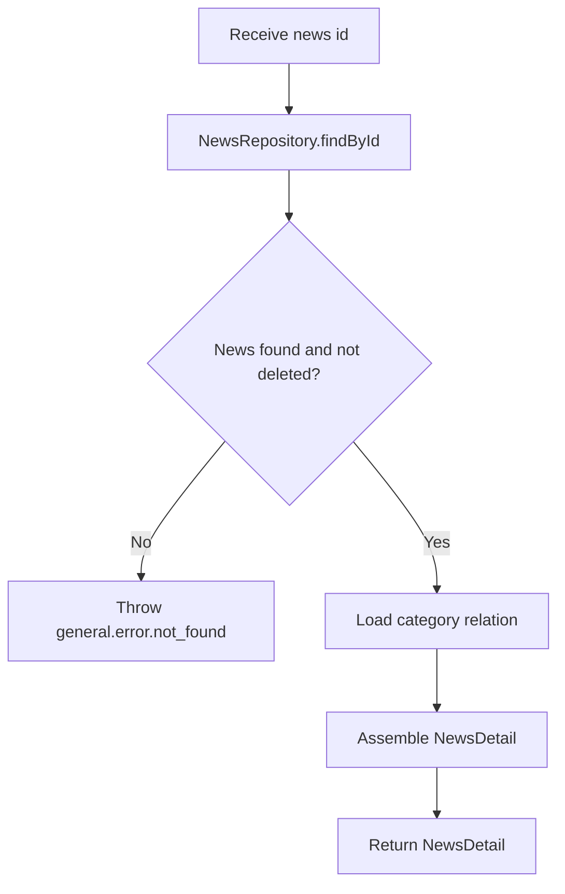

# News v0

## Changelog Summary

- v0 · 2026-09-04 · Initial feature specification generated from `documentation/00.brief-early.md`.

## Objectives

### Overview

News provides short market information and community-relevant updates (`documentation/00.brief-early.md` §8). Each news item has a title, short summary, publish date, optional image and a category. The list lives inside the Updates feed (with the `News` filter); clicking an item opens the full article page.

Related features (specified separately): Updates Feed (owns the merged list UI), Announcement (sibling content type), Home Dashboard (latest updates preview shows news items), Search (news titles are searchable), Video Library (shares the Category taxonomy).

Out of scope for v0: authoring/publishing UI (Admin epic, needs product input), rich-text editor, images galleries beyond one optional cover image, comments.

### User Flow

```mermaid
flowchart TD
    A[Authenticated Member] --> B[Open news item from Updates, Home or Search]
    B --> C[GET /api/v1/news/{id}]
    C --> D{API response?}
    D -->|404 not found| E[Show `News not found` empty state with back link]
    D -->|500 server error| F[Show error state with `Try Again` button]
    F --> C
    D -->|200 success| G[Render optional cover image]
    G --> H[Render category badge and title]
    H --> I[Render publish date and full content]
    I --> J[Member clicks back or navigation]
    J --> K[Return to previous page]
```

### Functional Requirements

| ID | Requirement |
|----|-------------|
| FR-001 | The article page shows the optional cover image when `imageUrl` exists; otherwise no image block is rendered. |
| FR-002 | The article page shows category badge, title, publish date and the full `content` as formatted text (paragraphs). |
| FR-003 | The list representation (consumed by Updates Feed and Home) shows title, short summary, publish date, optional image thumbnail and category. |
| FR-004 | A non-existent or deleted news id renders `News not found` (HTTP 404). |
| FR-005 | The page is accessible only to authenticated members; unauthenticated visitors are redirected to Login. |
| FR-006 | A back affordance returns the member to where they came from (Updates feed by default). |

## Visual Specification

### Layout

```
+--------------------------------+
| ← Back to Updates       [Nav]  |
+--------------------------------+
| [   Cover Image (optional)   ] |
+--------------------------------+
| MARKET UPDATE                  |
|                                |
| Foreign Flow Returns to        |
| Banking Stocks                 |
|                                |
| Sep 7                          |
|                                |
| Foreign investors recorded     |
| stronger buying activity       |
| across major banking stocks    |
| today.                         |
|                                |
| ...full article content...     |
+--------------------------------+
```

### UI Components

| Component | Source |
|-----------|--------|
| CategoryBadge | `src/components/ui/category-badge.tsx` (custom, Tailwind) |
| ArticleBody | `src/components/updates/article-body.tsx` (custom, Tailwind) |
| Button | `src/components/ui/button.tsx` (custom, Tailwind) |
| EmptyState | `src/components/ui/empty-state.tsx` (custom, Tailwind) |
| Skeleton | `src/components/ui/skeleton.tsx` (custom, Tailwind) |

### Responsive Behavior

| Platform | Description |
|----------|-------------|
| Desktop  | Article column max-width 720px, centered |
| Tablet   | Same layout with 24px padding |
| Mobile   | Full-width article, 16px padding, cover image full-bleed |

### States

| State     | Description |
| --------- | ----------- |
| Default   | Article rendered with all available fields |
| Loading   | Article skeleton |
| Not Found | `News not found` empty state with back to Updates link |
| Error     | Error message with `Try Again` button |

## Acceptance Criteria

- [ ] Article shows category badge, title, publish date and full content
- [ ] Cover image renders only when it exists
- [ ] Unknown or deleted news id shows the `News not found` state
- [ ] Unauthenticated visitors are redirected to Login
- [ ] Back navigation returns to the previous page

## Technical Specification

### Database Model

#### Entity Diagram



#### Schema

```prisma
model Category {
  id        String   @id @default(uuid())
  name      String   @unique
  slug      String   @unique
  createdAt DateTime @default(now())
  updatedAt DateTime @updatedAt
  videos    Video[]
  news      News[]
}

model News {
  id          String    @id @default(uuid())
  title       String
  summary     String
  content     String
  imageUrl    String?
  categoryId  String
  category    Category  @relation(fields: [categoryId], references: [id])
  isFeatured  Boolean   @default(false)
  publishedAt DateTime
  createdAt   DateTime  @default(now())
  updatedAt   DateTime  @updatedAt
  deletedAt   DateTime?

  @@index([publishedAt])
  @@index([categoryId])
}
```

### Context

#### Repository Layer

##### NewsRepository

```typescript
interface NewsRepository {
  findById(id: string): Promise<News | null>;
  findMany(page: number, pageSize: number): Promise<PaginatedResult<News>>;
}
```

#### Service Layer

##### NewsService

```typescript
interface NewsService {
  getNewsById(id: string): Promise<NewsDetail>;
  listNews(page: number, pageSize: number): Promise<PaginatedResult<NewsSummary>>;
}

interface NewsDetail {
  id: string;
  title: string;
  content: string;
  imageUrl: string | null;
  category: { id: string; name: string; slug: string };
  publishedAt: Date;
}

interface NewsSummary {
  id: string;
  title: string;
  summary: string;
  imageUrl: string | null;
  category: { id: string; name: string; slug: string };
  publishedAt: Date;
}
```

###### getNewsById Diagram



### API

#### GET /api/v1/news

```yaml
request:
  method: GET
  url: /api/v1/news
  header:
    "Authorization": "Bearer {accessToken}"
  query:
    page: number
    pageSize: number
response:
  200:
    data:
      - id: string
        title: string
        summary: string
        imageUrl: string | "null"
        category:
          id: string
          name: string
          slug: string
        publishedAt: datetime
    pagination:
      page: number
      pageSize: number
      totalItems: number
      totalPages: number
  401:
    error:
      - path: ["general"]
        message: general.error.unauthorized
  500:
    error:
      - path: ["general"]
        message: general.error.server_error
```

#### GET /api/v1/news/{id}

```yaml
request:
  method: GET
  url: /api/v1/news/{id}
  header:
    "Authorization": "Bearer {accessToken}"
response:
  200:
    data:
      id: string
      title: string
      content: string
      imageUrl: string | "null"
      category:
        id: string
        name: string
        slug: string
      publishedAt: datetime
  401:
    error:
      - path: ["general"]
        message: general.error.unauthorized
  404:
    error:
      - path: ["general"]
        message: general.error.not_found
  500:
    error:
      - path: ["general"]
        message: general.error.server_error
```

## Code Changelog

| Layer | File | Description |
|-------|------|-------------|
| Shared (types) | `src/features/updates/update-types.ts` | `NewsSummaryDto` (FR-003) and `NewsDetailDto` (FR-001/002) with the embedded category |
| Repository | `src/features/updates/repository/news-repository.ts` | `NewsRepository` + `PrismaNewsRepository` — `findById` with category include and `findMany` offset pagination, both soft-delete filtered and ordered by `publishedAt` desc |
| Shared (mappers) | `src/features/updates/update-mappers.ts` | `toNewsSummaryDto` / `toNewsDetailDto` — `imageUrl` passes through as nullable so the cover renders only when present (FR-001) |
| Service | `src/features/updates/service/news-service.ts` | `getNewsById` throws `AppError(404, general.error.not_found)` for missing/deleted news (FR-004); `listNews` backs the list representation for FR-003 consumers |
| API | `src/app/api/v1/news/route.ts` | `GET /api/v1/news` — Bearer auth, page/pageSize defaults 1/12, `{ data, pagination }` envelope |
| API | `src/app/api/v1/news/[id]/route.ts` | `GET /api/v1/news/:id` — Bearer auth (FR-005), `{ data }` envelope, 404 error envelope (FR-004) |
| Page | `src/app/updates/news/[id]/page.tsx` | News detail page (async server component awaiting the `params` promise) |
| Page | `src/features/updates/components/news-detail-view.tsx` | Detail client view — optional cover image via `next/image` (FR-001), category badge, title, publish date, formatted paragraph body (FR-002), `News not found` empty state (FR-004), error retry, `Back to Updates` link (FR-006, static feed target), 401 redirect (FR-005) |
| UI Components | `src/components/updates/article-body.tsx` | Splits `content` on blank lines into paragraph blocks (FR-002) |
| UI Components | `src/components/ui/category-badge.tsx` | Category badge used on the article (FR-002) |
