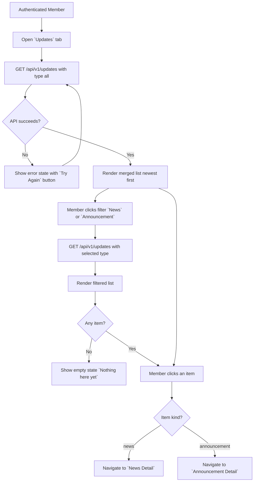
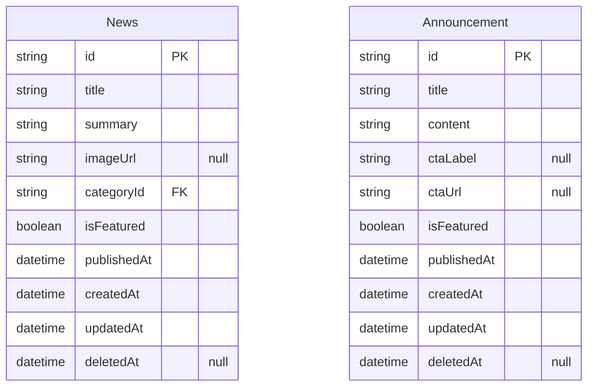
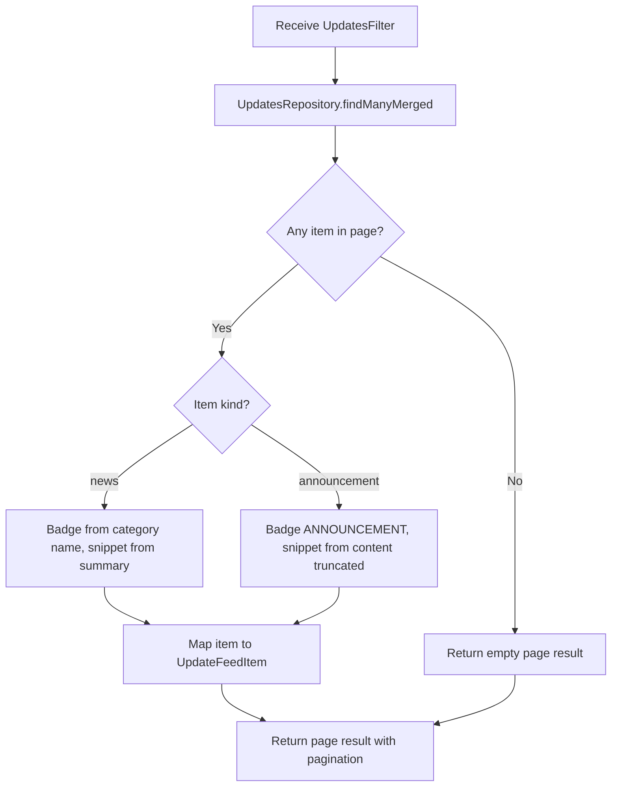

# Updates Feed v0

## Changelog Summary

- v0 · 2026-09-04 · Initial feature specification generated from `documentation/00.brief-early.md`.

## Objectives

### Overview

The Updates page is the combined feed of **News** and **Announcements** (`documentation/00.brief-early.md` §7). Members arrive from the bottom navigation (`Updates`) and from `View All Updates` on Home. A segmented filter switches between `All`, `News` and `Announcement`; items link to their respective detail pages.

This feature is the container/list view. The content types themselves are specified separately (News, Announcement) — this spec owns only the merged feed behavior.

Related features (specified separately): News (list item click target and detail), Announcement (list item click target and detail), Home Dashboard (latest updates preview), Search (results link here).

Out of scope for v0: member-posted updates, notifications for new updates.

### User Flow



### Functional Requirements

| ID | Requirement |
|----|-------------|
| FR-001 | The feed merges news and announcements into one list sorted by `publishedAt` descending. |
| FR-002 | A segmented control offers `All`, `News`, `Announcement`; default is `All`. |
| FR-003 | Selecting a filter re-queries the feed server-side by content type. |
| FR-004 | Each item shows a type badge (`ANNOUNCEMENT` or category label for news), title, one-line summary (news) or snippet (announcement), and relative publish time. |
| FR-005 | News items navigate to the News detail page; announcements navigate to the Announcement detail page. |
| FR-006 | Results are paginated, default page size 10; `Load More` appends the next page and is hidden on the last page. |
| FR-007 | An empty filter result shows the empty state `Nothing here yet`. |
| FR-008 | While loading, list skeletons are shown. |

## Visual Specification

### Layout

```
+--------------------------------+
| Updates                 [Nav]  |
+--------------------------------+
| (All) (News) (Announcement)    |
+--------------------------------+
| ANNOUNCEMENT                   |
| Live Session Tonight           |
| Join the weekly discussion...  |
| 2 hours ago                    |
+--------------------------------+
| MARKET NEWS                    |
| Banking Sector Update          |
| Foreign investors recorded...  |
| Today                          |
+--------------------------------+
| MARKET NEWS                    |
| Foreign Flow Returns to        |
| Banking Stocks...              |
| Yesterday                      |
+--------------------------------+
| [       Load More         ]    |
+--------------------------------+
```

### UI Components

| Component | Source |
|-----------|--------|
| UpdateListItem | `src/components/updates/update-list-item.tsx` (custom, Tailwind) |
| SegmentedControl | `src/components/ui/segmented-control.tsx` (custom, Tailwind) |
| TypeBadge | `src/components/ui/type-badge.tsx` (custom, Tailwind) |
| Button | `src/components/ui/button.tsx` (custom, Tailwind) |
| Skeleton | `src/components/ui/skeleton.tsx` (custom, Tailwind) |
| EmptyState | `src/components/ui/empty-state.tsx` (custom, Tailwind) |

### Responsive Behavior

| Platform | Description |
|----------|-------------|
| Desktop  | Single column list, max-width 720px, centered |
| Tablet   | Same layout with 24px padding |
| Mobile   | Full-width list, 16px padding, segmented control full-width |

### States

| State        | Description |
| ------------ | ----------- |
| Default      | `All` filter active, merged feed page 1 |
| Filtered     | Active segment highlighted, list filtered by type |
| Loading       | List skeletons |
| Empty        | `Nothing here yet` for the active filter |
| Load More    | Button visible while more pages exist, disabled while fetching |
| Error        | Error message with `Try Again` button |

## Acceptance Criteria

- [ ] News and announcements appear merged, newest first
- [ ] Filter switches between `All`, `News` and `Announcement` server-side
- [ ] Each item shows the correct type badge, title, snippet and relative time
- [ ] News items open the News detail page; announcements open the Announcement detail page
- [ ] `Load More` appends the next page and disappears on the last page
- [ ] Empty filter result shows the empty state
- [ ] Relative times render correctly (e.g. `2 hours ago`, `Today`, `Yesterday`)

## Technical Specification

### Database Model

#### Entity Diagram



#### Schema

```prisma
model News {
  id          String    @id @default(uuid())
  title       String
  summary     String
  content     String
  imageUrl    String?
  categoryId  String
  isFeatured  Boolean   @default(false)
  publishedAt DateTime
  createdAt   DateTime  @default(now())
  updatedAt   DateTime  @updatedAt
  deletedAt   DateTime?

  @@index([publishedAt])
  @@index([categoryId])
}

model Announcement {
  id          String    @id @default(uuid())
  title       String
  content     String
  ctaLabel    String?
  ctaUrl      String?
  isFeatured  Boolean   @default(false)
  publishedAt DateTime
  createdAt   DateTime  @default(now())
  updatedAt   DateTime  @updatedAt
  deletedAt   DateTime?

  @@index([publishedAt])
}
```

### Context

#### Repository Layer

##### UpdatesRepository

```typescript
type UpdateKind = "news" | "announcement";

interface UpdatesFilter {
  type: "all" | UpdateKind;
  page: number;
  pageSize: number;
}

interface UpdatesRepository {
  findManyMerged(filter: UpdatesFilter): Promise<PaginatedResult<{ kind: UpdateKind; item: News | Announcement }>>;
}
```

#### Service Layer

##### UpdatesService

```typescript
interface UpdatesService {
  listUpdates(filter: UpdatesFilter): Promise<PaginatedResult<UpdateFeedItem>>;
}

interface UpdateFeedItem {
  kind: UpdateKind;
  id: string;
  title: string;
  snippet: string;
  badgeLabel: string;
  publishedAt: Date;
}
```

###### listUpdates Diagram



### API

#### GET /api/v1/updates

```yaml
request:
  method: GET
  url: /api/v1/updates
  header:
    "Authorization": "Bearer {accessToken}"
  query:
    type: all | news | announcement
    page: number
    pageSize: number
response:
  200:
    data:
      - kind: news | announcement
        id: string
        title: string
        snippet: string
        badgeLabel: string
        publishedAt: datetime
    pagination:
      page: number
      pageSize: number
      totalItems: number
      totalPages: number
  400:
    error:
      - path: ["type"]
        message: general.error.validation
  401:
    error:
      - path: ["general"]
        message: general.error.unauthorized
  500:
    error:
      - path: ["general"]
        message: general.error.server_error
```

## Code Changelog

| Layer | File | Description |
|-------|------|-------------|
| Shared (utils) | `src/lib/text/truncate.ts` | Reused for the announcement snippet (140 chars) |
| Repository | `src/features/updates/repository/updates-repository.ts` | `findManyMerged` — fetches news (with category) and announcements in parallel, filters by type before sorting, orders by `publishedAt` desc (FR-001) and paginates by slicing the merged list; acceptable for MVP volumes, move to DB-level union pagination if lists grow |
| Shared (types) | `src/features/updates/update-types.ts` | `UpdateKind`, `UpdatesFilter`, `UpdateFeedItemDto` and `updatesQuerySchema` (zod: `type` enum `all`/`news`/`announcement` default `all` per FR-002, page/pageSize with default 10 per FR-006) |
| Shared (mappers) | `src/features/updates/update-mappers.ts` | `toUpdateFeedItem` — `badgeLabel` is the news category name or `Announcement` (FR-004); snippet is the news summary or a truncated announcement content |
| Service | `src/features/updates/service/updates-service.ts` | `UpdatesService.listUpdates` — validates + delegates to the merged repository |
| API | `src/app/api/v1/updates/route.ts` | `GET /api/v1/updates?type=&page=` — Bearer auth, zod query validation (400 `general.error.validation`), `{ data, pagination }` envelope; server-side filtering per FR-003 |
| Page | `src/app/updates/page.tsx` | Updates page (server component + metadata) |
| Page | `src/features/updates/components/updates-feed.tsx` | Feed client view — segmented `All`/`News`/`Announcement` control (FR-002), re-queries on filter change (FR-003), badge + title + snippet + relative time rows (FR-004), per-kind detail links (FR-005), `Load More` appending pages and hidden on the last page (FR-006), `Nothing here yet` empty state (FR-007), list skeletons (FR-008), error state with `Try Again`, 401 redirect |
| UI Components | `src/components/updates/update-list-item.tsx` | Reworked to render the shared feed item (badge, title, optional one-line snippet, relative time) and route news vs announcements to their detail pages |
| UI Components | `src/components/ui/segmented-control.tsx` | Accessible segmented control used for the type filter |
| Service | `prisma/seed.ts` | Added 6 news briefings and 3 more announcements (one intentionally without a CTA) so the merged feed spans 12 items across 2 pages |
