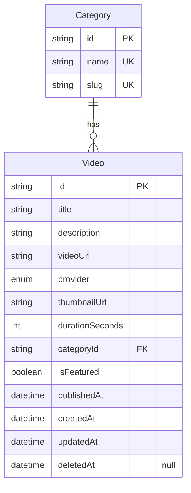
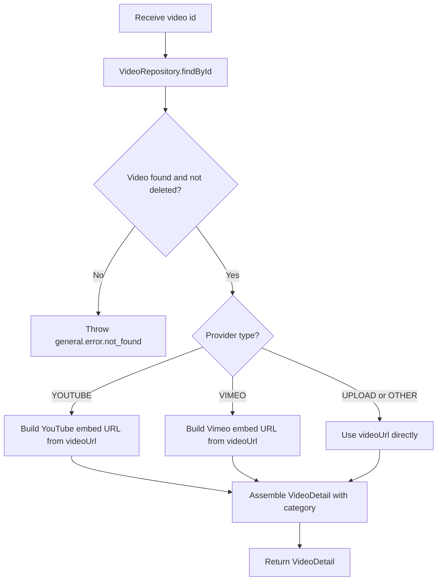

# Video Detail v0

## Changelog Summary

- v0 · 2026-09-04 · Initial feature specification generated from `documentation/00.brief-early.md`.

## Objectives

### Overview

Video Detail is the watch page for a single published video (`documentation/00.brief-early.md` §6). It renders the video player plus the video information block. Members arrive from the Video Library grid, Home latest videos, Home featured banner and Search results.

The player supports multiple providers (`documentation/00.brief-early.md` §6): uploaded recordings (direct file), Vimeo, unlisted YouTube and any other provider exposing an embeddable URL. The MVP renders the appropriate embed/inline player based on the `provider` field — no self-hosted transcoding pipeline.

Related features (specified separately): Video Library (entry point and back navigation), Home Dashboard (featured and latest videos), Search (results link here).

Out of scope for v0 (nice-to-have per brief §14): comments/discussion, bookmarks, reactions/likes, video chapters, related content.

### User Flow

```mermaid
flowchart TD
    A[Authenticated Member] --> B[Open a video from Library, Home or Search]
    B --> C[GET /api/v1/videos/{id}]
    C --> D{API response?}
    D -->|404 not found| E[Show `Video not found` empty state with back link]
    D -->|500 server error| F[Show error state with `Try Again` button]
    F --> C
    D -->|200 success| G[Render player by provider]
    G --> H{Provider type?}
    H -->|YOUTUBE| I[Render YouTube iframe embed]
    H -->|VIMEO| J[Render Vimeo iframe embed]
    H -->|UPLOAD or OTHER| K[Render native video element with videoUrl]
    I --> L[Render video info block]
    J --> L
    K --> L
    L --> M[Member clicks back or navigation]
    M --> N[Return to previous page]
```

### Functional Requirements

| ID | Requirement |
|----|-------------|
| FR-001 | The player area renders based on `provider`: `YOUTUBE` and `VIMEO` render an iframe embed; `UPLOAD` and `OTHER` render a native HTML5 video element with `videoUrl`. |
| FR-002 | The info block shows title, publish date, duration (formatted `mm min`), category badge and full description. |
| FR-003 | The page is accessible only to authenticated members; unauthenticated visitors are redirected to Login. |
| FR-004 | A non-existent or deleted video id renders the `Video not found` empty state (HTTP 404). |
| FR-005 | A back affordance returns the member to where they came from (Library by default). |
| FR-006 | Player and info layout are mobile responsive; the player keeps a 16:9 ratio at all widths. |

## Visual Specification

### Layout

```
+--------------------------------+
| ← Back to Videos        [Nav]  |
+--------------------------------+
| +============================+ |
| |        VIDEO PLAYER        | |
| |        (16:9 ratio)        | |
| +============================+ |
|                                |
| Weekly Market Outlook          |
| Sep 7 · 24 min · (Market       |
| Outlook)                       |
|                                |
| This session covers IHSG,      |
| banking stocks and key market  |
| themes for the week.           |
+--------------------------------+
```

### UI Components

| Component | Source |
|-----------|--------|
| VideoPlayer | `src/components/videos/video-player.tsx` (custom, Tailwind) |
| CategoryBadge | `src/components/ui/category-badge.tsx` (custom, Tailwind) |
| Button | `src/components/ui/button.tsx` (custom, Tailwind) |
| EmptyState | `src/components/ui/empty-state.tsx` (custom, Tailwind) |
| Skeleton | `src/components/ui/skeleton.tsx` (custom, Tailwind) |

### Responsive Behavior

| Platform | Description |
|----------|-------------|
| Desktop  | Content column max-width 840px, player full column width at 16:9 |
| Tablet   | Same layout, content column at 100% with 24px padding |
| Mobile   | Full-width player, 16px padding, info block stacks below |

### States

| State          | Description |
| -------------- | ----------- |
| Default        | Player rendered per provider, info block visible |
| Loading        | Player and info skeletons |
| Not Found      | `Video not found` empty state with back to Videos link |
| Error          | Error message with `Try Again` button |

## Acceptance Criteria

- [ ] YouTube videos render in an iframe embed
- [ ] Vimeo videos render in an iframe embed
- [ ] Uploaded and other-provider videos play in a native video element
- [ ] Title, publish date, duration, category badge and description are shown
- [ ] Player keeps a 16:9 ratio on mobile, tablet and desktop
- [ ] Unknown or deleted video id shows the `Video not found` state
- [ ] Unauthenticated visitors are redirected to Login

## Technical Specification

### Database Model

#### Entity Diagram



#### Schema

```prisma
enum VideoProvider {
  UPLOAD
  VIMEO
  YOUTUBE
  OTHER
}

model Video {
  id              String        @id @default(uuid())
  title           String
  description     String
  videoUrl        String
  provider        VideoProvider @default(YOUTUBE)
  thumbnailUrl    String
  durationSeconds Int
  categoryId      String
  category        Category      @relation(fields: [categoryId], references: [id])
  isFeatured      Boolean       @default(false)
  publishedAt     DateTime
  createdAt       DateTime      @default(now())
  updatedAt       DateTime      @updatedAt
  deletedAt       DateTime?

  @@index([categoryId])
  @@index([publishedAt])
}

model Category {
  id        String   @id @default(uuid())
  name      String   @unique
  slug      String   @unique
  createdAt DateTime @default(now())
  updatedAt DateTime @updatedAt
  videos    Video[]
  news      News[]
}
```

### Context

#### Repository Layer

##### VideoRepository

```typescript
interface VideoRepository {
  findById(id: string): Promise<Video | null>;
}
```

#### Service Layer

##### VideoService

```typescript
interface VideoService {
  getVideoById(id: string): Promise<VideoDetail>;
}

interface VideoDetail {
  id: string;
  title: string;
  description: string;
  provider: VideoProvider;
  embedUrl: string;
  thumbnailUrl: string;
  durationSeconds: number;
  category: { id: string; name: string; slug: string };
  publishedAt: Date;
}
```

###### getVideoById Diagram



### API

#### GET /api/v1/videos/{id}

```yaml
request:
  method: GET
  url: /api/v1/videos/{id}
  header:
    "Authorization": "Bearer {accessToken}"
response:
  200:
    data:
      id: string
      title: string
      description: string
      provider: UPLOAD | VIMEO | YOUTUBE | OTHER
      embedUrl: string
      thumbnailUrl: string
      durationSeconds: number
      category:
        id: string
        name: string
        slug: string
      publishedAt: datetime
  401:
    error:
      - path: ["general"]
        message: general.error.unauthorized
  404:
    error:
      - path: ["general"]
        message: general.error.not_found
  500:
    error:
      - path: ["general"]
        message: general.error.server_error
```

## Code Changelog

| Layer | File | Description |
|-------|------|-------------|
| Shared (auth) | `src/lib/auth/jwt.ts` | Added `verifyAccessToken` — validates the HS256 token and its `sub`/`role` claims, used by the new `requireAuth` guard (FR-003) |
| Shared (API) | `src/lib/api/auth.ts` | `requireAuth(request)` — Bearer header check + token verification, throws `AppError(401, unauthorized)`; shared by all protected routes |
| Shared (API) | `src/lib/api/authed-fetch.ts` | Client-side `authedFetch<T>` — attaches the stored token, maps 401 to `unauthenticated` (views clear the session and redirect to Login, FR-003), 404 to `not-found` (FR-004), other failures to `failed` |
| Shared (auth) | `src/lib/auth/token-storage.ts` | Token/user persistence in localStorage with `clearSession` for the shared 401 redirect flow |
| Shared (utils) | `src/features/videos/embed-url.ts` | `toEmbedUrl(provider, videoUrl)` — extracts the YouTube (`youtu.be` path, `?v=`, `/embed`, `/shorts`) or Vimeo id into a player embed URL; other providers fall back to the raw URL (FR-001) |
| Repository | `src/features/videos/repository/video-repository.ts` | Added `findById(id)` with the category include, soft-delete filtered (FR-002/004) |
| Shared (mappers) | `src/features/videos/video-mappers.ts` | Added `toVideoDetailDto` — full description (not truncated) plus `embedUrl` resolved from the provider and `videoUrl` |
| Service | `src/features/videos/service/video-service.ts` | Added `getVideoById` — throws `AppError(404, general.error.not_found)` for missing/deleted videos (FR-004) |
| API | `src/app/api/v1/videos/[id]/route.ts` | `GET /api/v1/videos/:id` — Bearer auth, `{ data }` envelope, 404 error envelope per API spec (FR-003/004) |
| Page | `src/app/videos/[id]/page.tsx` | Video detail page (async server component awaiting the `params` promise) |
| Page | `src/features/videos/components/video-detail-view.tsx` | Detail client view — loading skeletons, `Video not found` empty state (FR-004), error state with retry, 401 redirect; `Back to Videos` link to the Library (FR-005, static Library target rather than browser history for MVP) |
| UI Components | `src/components/videos/video-player.tsx` | `YOUTUBE`/`VIMEO` render an iframe embed, `UPLOAD`/`OTHER` render a native video element; 16:9 ratio at all widths (FR-001/006) |
