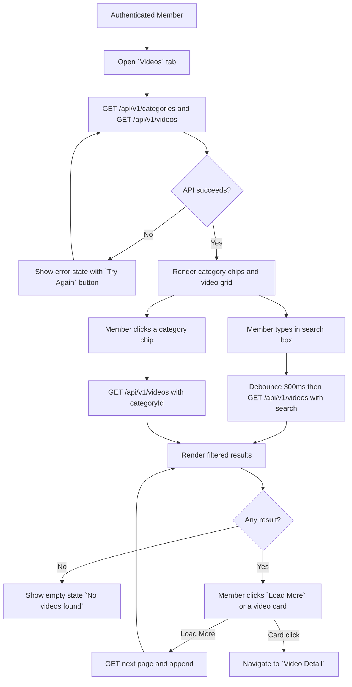
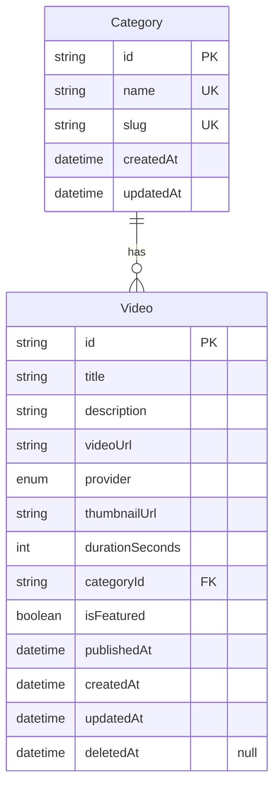
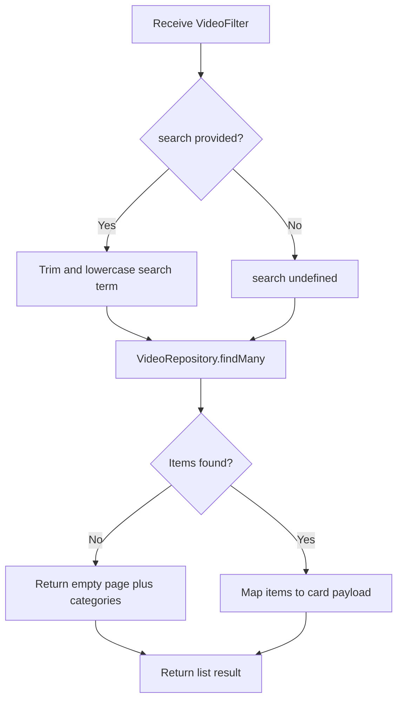

# Video Library v0

## Changelog Summary

- v0 · 2026-09-04 · Initial feature specification generated from `documentation/00.brief-early.md`.

## Objectives

### Overview

The Video Library is the catalog of all published market videos (`documentation/00.brief-early.md` §5). Members arrive from the bottom navigation (`Videos`) and from `View All Videos` on Home. They can browse the full list, search by title and filter by category, then open a video's detail page.

Categories are a shared, simple taxonomy (`documentation/00.brief-early.md` §11: "Keep the category system simple for MVP"). They are owned by the content model and used by the Video Library (video categories) and News (news categories); Announcements do not use categories.

Related features (specified separately): Video Detail (card click target), Home Dashboard (latest videos source), Search (global search across content types).

Out of scope for v0: category management UI (seeded list), sorting options, playlists/collections.

### User Flow



### Functional Requirements

| ID | Requirement |
|----|-------------|
| FR-001 | Videos are listed in reverse-chronological order by `publishedAt`. |
| FR-002 | Each video card shows thumbnail, title, short description (max 2 lines), duration and publish date, and links to Video Detail. |
| FR-003 | Category chips are rendered from the categories that have at least one published video, prefixed by `All`. |
| FR-004 | Selecting a category chip filters the grid server-side by `categoryId`; `All` clears the filter. |
| FR-005 | The search box filters server-side by case-insensitive title match, debounced at 300ms, and combines with the active category filter (AND). |
| FR-006 | Results are paginated, default page size 12; `Load More` appends the next page and is hidden on the last page. |
| FR-007 | When a filter/search combination returns nothing, show empty state `No videos found`. |
| FR-008 | While loading, skeletons are shown in the grid. |

## Visual Specification

### Layout

```
+--------------------------------+
| Videos                  [Nav]  |
+--------------------------------+
| [ Search videos...        ]    |
+--------------------------------+
| (All)(Market Outlook)          |
| (Stock Analysis)(Education)    |
| (Market Recap)                 |
+--------------------------------+
| [Thumb]   [Thumb]   [Thumb]    |
| Title     Title     Title      |
| 24 min    18 min    32 min     |
| Sep 7     Sep 5     Sep 2      |
|                                |
| [Thumb]   [Thumb]   [Thumb]    |
| ...                            |
|                                |
| [       Load More         ]    |
+--------------------------------+
```

### UI Components

| Component | Source |
|-----------|--------|
| VideoCard | `src/components/videos/video-card.tsx` (custom, Tailwind) |
| SearchInput | `src/components/ui/search-input.tsx` (custom, Tailwind) |
| Chip / ToggleGroup | `src/components/ui/chip.tsx` (custom, Tailwind) |
| Button | `src/components/ui/button.tsx` (custom, Tailwind) |
| Skeleton | `src/components/ui/skeleton.tsx` (custom, Tailwind) |
| EmptyState | `src/components/ui/empty-state.tsx` (custom, Tailwind) |

### Responsive Behavior

| Platform | Description |
|----------|-------------|
| Desktop  | Video grid of 3 columns, max-width 1200px |
| Tablet   | Video grid of 2 columns |
| Mobile   | Video grid of 1 column, category chips horizontally scrollable |

### States

| State             | Description |
| ----------------- | ----------- |
| Default           | `All` chip active, full unfiltered list, page 1 |
| Loading           | Grid skeletons, chips visible |
| Filtered          | Active chip highlighted, list filtered |
| Searching         | Debounced search in progress, previous list dimmed |
| Empty             | `No videos found` with `Clear Filters` action |
| Load More         | Button visible while more pages exist, disabled while fetching |
| Error             | Error message with `Try Again` button |

## Acceptance Criteria

- [ ] All published videos are listed newest first
- [ ] Category chips include `All` plus every category that has videos
- [ ] Clicking a category chip filters the grid and highlights the chip
- [ ] Typing in search filters by title with 300ms debounce
- [ ] Search and category filter combine (AND)
- [ ] `Load More` appends the next page and disappears on the last page
- [ ] No results shows the empty state with a `Clear Filters` action
- [ ] Clicking a card opens the correct Video Detail page

## Technical Specification

### Database Model

#### Entity Diagram



#### Schema

```prisma
enum VideoProvider {
  UPLOAD
  VIMEO
  YOUTUBE
  OTHER
}

model Category {
  id        String   @id @default(uuid())
  name      String   @unique
  slug      String   @unique
  createdAt DateTime @default(now())
  updatedAt DateTime @updatedAt
  videos    Video[]
  news      News[]
}

model Video {
  id              String        @id @default(uuid())
  title           String
  description     String
  videoUrl        String
  provider        VideoProvider @default(YOUTUBE)
  thumbnailUrl    String
  durationSeconds Int
  categoryId      String
  category        Category      @relation(fields: [categoryId], references: [id])
  isFeatured      Boolean       @default(false)
  publishedAt     DateTime
  createdAt       DateTime      @default(now())
  updatedAt       DateTime      @updatedAt
  deletedAt       DateTime?

  @@index([categoryId])
  @@index([publishedAt])
}
```

### Context

#### Repository Layer

##### VideoRepository

```typescript
interface VideoFilter {
  search?: string;
  categoryId?: string;
  page: number;
  pageSize: number;
}

interface VideoRepository {
  findMany(filter: VideoFilter): Promise<PaginatedResult<Video>>;
  findManyCategoriesWithVideos(): Promise<Category[]>;
}
```

##### CategoryRepository

```typescript
interface CategoryRepository {
  findMany(): Promise<Category[]>;
}
```

#### Service Layer

##### VideoService

```typescript
interface VideoService {
  listVideos(filter: VideoFilter): Promise<PaginatedResult<Video> & { categories: Category[] }>;
}
```

###### listVideos Diagram



### API

#### GET /api/v1/videos

```yaml
request:
  method: GET
  url: /api/v1/videos
  header:
    "Authorization": "Bearer {accessToken}"
  query:
    search: string | "null"
    categoryId: string | "null"
    page: number
    pageSize: number
response:
  200:
    data:
      - id: string
        title: string
        shortDescription: string
        thumbnailUrl: string
        durationSeconds: number
        publishedAt: datetime
    pagination:
      page: number
      pageSize: number
      totalItems: number
      totalPages: number
  401:
    error:
      - path: ["general"]
        message: general.error.unauthorized
  500:
    error:
      - path: ["general"]
        message: general.error.server_error
```

#### GET /api/v1/categories

```yaml
request:
  method: GET
  url: /api/v1/categories
  header:
    "Authorization": "Bearer {accessToken}"
response:
  200:
    data:
      - id: string
        name: string
        slug: string
  401:
    error:
      - path: ["general"]
        message: general.error.unauthorized
  500:
    error:
      - path: ["general"]
        message: general.error.server_error
```

## Code Changelog

| Layer | File | Description |
|-------|------|-------------|
| Shared (API) | `src/lib/api/pagination.ts` | `PaginatedResult<T>` / `PaginationMeta` shared by all paginated endpoints (page, pageSize, totalItems, totalPages) |
| Shared (utils) | `src/lib/text/truncate.ts` | Shared truncate helper (extracted from the Home dashboard service) for short descriptions and snippets |
| Repository | `src/features/videos/video-types.ts` | `VideoFilter`, `VideoCardDto`, `CategoryDto` and `videosQuerySchema` (zod: trim, page/pageSize coercion, pageSize default 12 per FR-006) |
| Repository | `src/features/videos/repository/video-repository.ts` | `VideoRepository` interface + `PrismaVideoRepository` — `findMany` with reverse-chronological order (FR-001), case-insensitive title search (FR-005), `categoryId` filter (FR-004), offset pagination; `findManyCategoriesWithVideos` returns only categories having at least one published video (FR-003) |
| Repository | `src/features/videos/repository/category-repository.ts` | `CategoryRepository` interface + `PrismaCategoryRepository` with `findMany` (all categories; reserved for news filtering and future admin category management) |
| Shared (mappers) | `src/features/videos/video-mappers.ts` | `toVideoCardDto` / `toCategoryDto` — also reused by the Home dashboard service |
| Service | `src/features/videos/service/video-service.ts` | `VideoService` interface + `VideoServiceImpl` — normalizes the search term (trim + lowercase per `listVideos` diagram), fetches the page and categories in parallel |
| Service | `src/features/videos/service/category-service.ts` | `CategoryService` interface + `CategoryServiceImpl` — serves `GET /api/v1/categories` from `findManyCategoriesWithVideos` so chips match FR-003 |
| Service | `src/features/home/home-types.ts` | `HomeFeedVideo` now aliases the shared `VideoCardDto` (single card payload across Home and Video Library) |
| API | `src/app/api/v1/videos/route.ts` | `GET /api/v1/videos` — Bearer auth, zod query validation (400 `general.error.validation` on bad query), `{ data, pagination }` envelope per API spec |
| API | `src/app/api/v1/categories/route.ts` | `GET /api/v1/categories` — Bearer auth, `{ data }` envelope per API spec |
| Page | `src/app/videos/page.tsx` | Videos page (server component + metadata) |
| Page | `src/features/videos/components/video-library.tsx` | Library client component — category chips with `All` (FR-003/004), 300ms debounced search combined with the active category (FR-005), `Load More` appending pages and hidden on the last page (FR-006), `No videos found` empty state with `Clear Filters` (FR-007), grid skeletons (FR-008), dimmed grid while a debounced search is in flight, error state with `Try Again`, redirect to Login on 401 |
| UI Components | `src/components/ui/search-input.tsx` | Search box used by the library toolbar |
| UI Components | `src/components/ui/chip.tsx` | Category chip with active highlight (`aria-pressed`) |
| UI Components | `src/components/ui/empty-state.tsx` | Empty state panel with optional action |
| Service | `prisma/seed.ts` | Added 11 generated `Market Insights Episode` videos across Market Outlook / Stock Analysis / Education / Market Recap so pagination (2 pages), `Load More` and the Education chip are exercisable |
